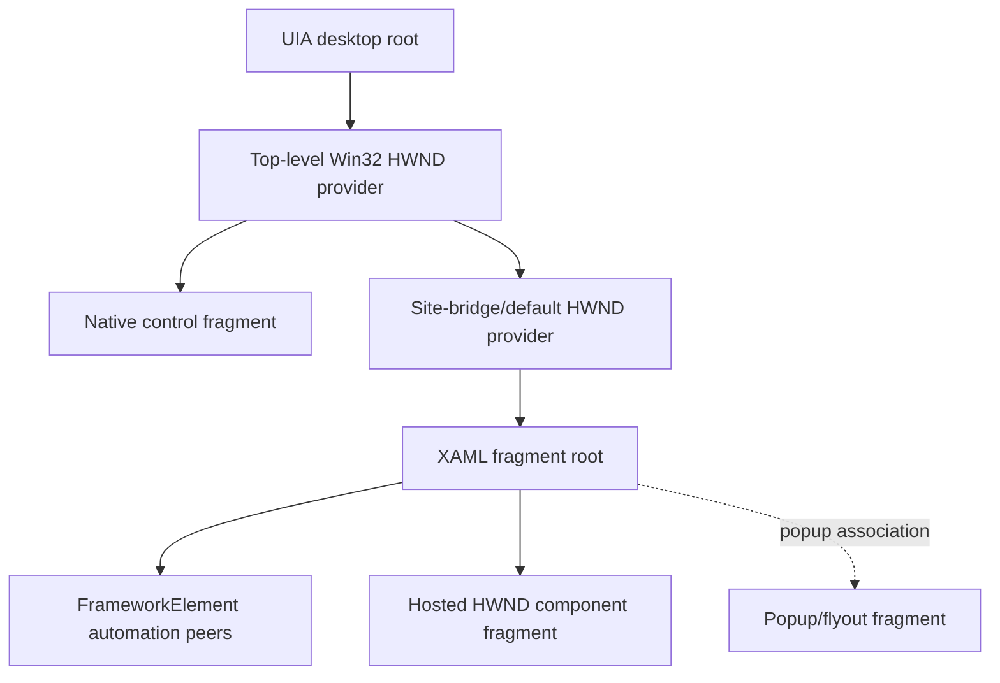

# Accessibility across the island boundary

Use this guide when a Win32 host must expose one coherent UI Automation tree
across native controls, a `DesktopWindowXamlSource`, hosted HWND descendants, and
XAML popups. A visible and keyboard-usable island is not automatically an
accessible island; validate the client-visible tree and behavior from another
process.

## Applies to

- `DesktopWindowXamlSource` in Windows App SDK 1.4 or later.
- Native and WinUI UI Automation providers in packaged or unpackaged desktop apps.
- Standard WinUI peers, custom `FrameworkElementAutomationPeer` implementations,
  native providers, and windowed popup fragments.
- API and source-observed behavior checked against Windows App SDK 2.3.1.
- x64 Control View ancestry, patterns, and focus measured in a consuming
  framework; ARM64 execution and assistive-technology passes remain manual gates.

The [bundled minimal host](assets/minimal-host/README.md) establishes the island
but does not assign test automation IDs or capture UI Automation artifacts.

## Provider topology

UI Automation core combines fragments from different provider technologies. The
exact count of native adapter nodes is not a stable application contract. Assert
that required native and XAML elements share the expected application ancestry;
do not pin every incidental wrapper class or depth unless the product owns it.

The top-level native element should expose its HWND. XAML descendants commonly
report `NativeWindowHandle=0`; that is not evidence they escaped the application
tree. Conversely, a nonzero HWND on an ancestor must still be validated against
the expected process before the harness messages or captures it.

## Set semantic properties deliberately

`AutomationProperties` attached values supplement or override values supplied by
a control's peer. Use them to express application semantics, not to mirror visual
implementation details.

- `Name` is the localized, human-readable identifier announced by assistive
  technology. Do not use internal variable names or untranslated test text.
- `AutomationId` is a stable programmatic identifier within the tested scope. Keep
  it deterministic and unique where automation depends on it; do not present it
  to users.
- `LabeledBy`, `HelpText`, `FullDescription`, heading/landmark properties, set
  position, and live-region settings should match actual relationships and
  behavior.
- `AccessibilityView` can remove decorative elements from Control or Content View;
  verify that it does not hide meaningful information.
- Password and sensitive-input peers must preserve protected-content semantics.

Prefer the useful name already forwarded by a standard peer when it is localized
and unambiguous. Set an explicit name when the visual content is an icon, custom
drawing, duplicated label, or otherwise unsuitable.

## Use custom peers only for missing semantics

Standard WinUI controls already derive peers from `FrameworkElementAutomationPeer`
and expose their supported behavior. Do not wrap a standard peer merely to rename
it; use `AutomationProperties` first.

For a genuinely custom control:

1. Override `OnCreateAutomationPeer` on the owner element.
2. Derive from the nearest semantic peer, or from
   `FrameworkElementAutomationPeer` when no closer base exists.
3. Return the correct control type, localized name/type, class name, bounds,
   focusability, and children.
4. Implement only patterns backed by real behavior and state.
5. Raise property, structure, focus, live-region, and text events when the
   corresponding user-visible state changes.
6. Preserve thread affinity and translate failures at the provider boundary.

Do not expose one action through duplicate parent and child peers unless both are
independently meaningful to the user. Do not report an enabled Invoke, Value, or
RangeValue pattern whose operation is rejected by the control.

## Capture the client-visible tree out of process

Use a purpose-built client process or test runner. Capturing from the provider's
UI thread can hide cross-process marshalling, reentrancy, and timeout defects.

1. Launch one scenario process and wait for an `accessibility-ready` event emitted
   after content load and deterministic focus setup.
2. Validate the reported top-level HWND with `GetWindowThreadProcessId`: require
   the scenario process ID and, when part of the contract, the native UI thread ID.
3. Create the UI Automation root from that HWND.
4. Traverse `ControlViewWalker` for the product's user/action structure.
5. Use Content View separately when testing screen-reader content semantics and
   Raw View only as a diagnostic for missing adapters or fragments.
6. Capture parent indices as the traversal proceeds so ancestry can be asserted
   without querying providers again.
7. Retry the complete snapshot only within a bounded readiness window when
   asynchronous peers have not appeared; do not retry forever.

The UI Automation tree is dynamic. One `ElementNotAvailable` result can mean a
node disappeared during capture. Record it and retry the bounded scenario when
the expected UI should be stable; do not silently turn a missing required control
into a passing partial snapshot.

## Bound every capture

UI Automation providers are external code from the client's perspective. A
malformed, stale, or hung provider must not consume unbounded memory or time.

Set explicit limits for:

- total capture duration and per-worker process lifetime;
- depth, for example 32;
- elements, for example 512;
- children queued before the element cap;
- property and string count;
- each Name, AutomationId, class name, help text, and value length;
- runtime-ID component count;
- supported-pattern enumeration;
- stdout/stderr and serialized snapshot bytes.

A `Task` timeout does not necessarily cancel an in-progress cross-process UIA COM
call. Run capture in a killable worker process when a hard timeout is required.
Retain the scenario process long enough to diagnose the worker timeout, then clean
up both process trees deterministically.

Do not record password values, private document contents, tokens, or arbitrary
external text in diagnostics. Store only the bounded properties required by the
test, and redact sensitive fields before artifact persistence.

## Snapshot schema

For each Control View element, capture at least:

| Field | Purpose |
| --- | --- |
| Depth and parent index | Prove a coherent tree and native/XAML ancestry. |
| Name and AutomationId | Human semantics and deterministic test lookup. |
| ControlType and class name | Semantic role and diagnostic framework clue. |
| NativeWindowHandle | Identify native adapter nodes; not required for XAML peers. |
| ProcessId | Detect a fragment that escaped to another process unexpectedly. |
| IsEnabled/IsKeyboardFocusable/HasKeyboardFocus | Interaction and focus contract. |
| BoundingRectangle/IsOffscreen | Geometry, visibility, DPI, clipping, magnifier. |
| RuntimeId | Detect duplicate identities within this capture. |
| Supported patterns | Prove required capabilities. |

Runtime IDs are opaque and can change after process restart, source replacement,
or provider recreation. Require nonempty, unique IDs within one stable capture;
do not persist them as long-lived application identifiers.

Validate parent indices while reading the snapshot: every nonroot parent must
refer to an earlier element, and child depth must be exactly parent depth plus one.
This catches truncated or incorrectly serialized trees before semantic assertions.

## Assert behavior, not only control types

Control patterns represent capabilities and can be dynamic. Assert the patterns
required by the product's behavior rather than assuming every element of one
control type exposes an identical set in every state.

| User capability | Typical required pattern |
| --- | --- |
| Activate a button or command | Invoke |
| Read or set an unconstrained value | Value |
| Read or set a bounded numeric value | RangeValue |
| Read or navigate editable/rich text | Text, and Value when the peer supports it |
| Open or close a combo/menu | ExpandCollapse |
| Query selection container/items | Selection / SelectionItem |
| Scroll viewport/content | Scroll / ScrollItem when currently available |
| Toggle a binary state | Toggle |

Invoke the required pattern in at least one integration scenario and observe the
product result. Pattern presence alone does not prove the provider method works,
raises events, or respects disabled/read-only state.

For composite controls, locate meaningful descendants by stable AutomationId and
ancestry. Avoid `Single` assertions on a common ControlType across the whole tree;
the control template can contain several sliders, edits, or buttons.

## Prove the native/XAML boundary

A useful mixed fixture contains:

- one native focusable control before the island;
- a named XAML root group;
- a XAML button with Invoke;
- a XAML slider with RangeValue;
- a XAML edit with Text/Value as supported;
- one native focusable control after the island;
- a popup or flyout when the product uses one.

From the top-level HWND root, assert:

1. Exactly one application root for the captured window.
2. Valid parent/depth links for every captured element.
3. The named XAML root has an ancestor path back to the native application root.
4. At least one distinct native adapter/bridge ancestor where the measured
   topology exposes it, without pinning its class name.
5. Required XAML controls are descendants of the named root.
6. Required patterns and localized names are present.
7. Runtime IDs are unique within the capture.

Do not require every XAML peer to carry the top-level or site-bridge HWND. Do not
infer the UIA tree solely from `EnumChildWindows`; native and automation trees are
related but not identical.

## Focus and activation

Test focus as an end-to-end state:

1. Activate the intended top-level window under test policy.
2. Move from native-before into the first XAML focus candidate.
3. Move through several XAML peers and out to native-after.
4. Repeat backward.
5. Capture UIA after each boundary transition.
6. Require exactly the expected element to report keyboard focus.
7. Confirm native `GetFocus` and top-level activation are consistent with the
   current framework boundary.

Use [message-and-focus-routing.md](message-and-focus-routing.md) for correlation
and traversal mechanics. A UIA focus property can lag a transition; synchronize on
a scenario event or bounded focus-changed observation, not a fixed sleep.

Opening and closing a popup must move focus to and from meaningful peers without
leaving it on a destroyed popup HWND or invisible element. Include Escape,
keyboard invocation, pointer dismissal, and source teardown.

## High Contrast, theme, and text scale

Automated property capture does not prove visual accessibility. Run the real
system settings rather than emulating them with application colors.

- **High Contrast:** switch a Windows contrast theme, verify dynamic resources,
  focus indicators, selection, disabled states, and popup/airspace pixels. Do not
  equate dark mode with High Contrast.
- **Text scale:** test the supported Windows text-size range. Verify reflow,
  clipping, scroll access, popup placement, and that names/patterns remain stable.
- **Magnifier:** inspect native/XAML and popup edges at relevant zoom/docked modes;
  verify no stale or missing composited surface.
- **Color mode:** light, dark, and system modes must preserve the same semantic
  tree and patterns even when visual resources differ.

Screenshot contrast checks can catch known regressions but do not replace the
system modes or a human inspection of focus and readability.

## Narrator and keyboard manual script

For each supported architecture and deployment path:

1. Launch with Narrator already running, then launch with Narrator started after
   the app.
2. Navigate native-before, through the island, into popups, and native-after.
3. Confirm localized names, roles, states, values, ranges, and position-in-set.
4. Invoke controls and edit text without a pointer.
5. Verify focus announcements match visible/native focus.
6. Change value, selection, validation, and live-region state and listen for the
   intended event exactly once.
7. Close popups, reparent/replace content where supported, and exit cleanly.

Repeat essential traversal with keyboard only and with screen magnifier. Retain
the OS build, voice/language, text scale, contrast theme, app package/runtime, and
observed failures; a checkbox saying "Narrator passed" is not reproducible evidence.

## Popups, hosted HWNDs, and reparenting

Windowed XAML popups and hosted HWND components can add separate fragments. Capture
while each is open and require meaningful ancestry/ownership without assuming its
native wrapper depth. After close, the popup peers must disappear and focus must
return to a live element.

After source replacement or reparenting:

- discard old `AutomationElement` references and runtime IDs;
- capture from the current top-level HWND again;
- reject events or HWNDs from the old host generation;
- verify the XAML subtree reconnects to the intended native root;
- repeat focus and required-pattern assertions.

UIA references can keep proxy state alive after the provider disappears. Never use
a successful property read on an old proxy as proof that the new tree is correct.

## Failure signatures

| Symptom | First discriminating check |
| --- | --- |
| Island controls absent from Control View | Verify content is loaded, named peers exist, and capture starts at the correct top-level HWND. |
| XAML subtree appears as a separate app root | Validate HWND/process ownership and inspect Raw View fragment/adapter ancestry. |
| Duplicate or empty runtime IDs | Check provider identity and whether the snapshot merged generations. |
| Correct control type, unusable action | Query and invoke the required pattern; inspect enabled/read-only state. |
| Name is empty or implementation-like | Inspect localized `AutomationProperties.Name`, peer forwarding, and `LabeledBy`. |
| Focus announcement differs from visible focus | Correlate UIA focus, XAML focus event, native `GetFocus`, and activation timestamps. |
| Capture hangs | Move UIA to a killable worker and inspect the last provider/property requested. |
| Tree explodes in size | Enforce depth/element/string caps and inspect Raw versus Control View selection. |
| Works until reparenting | Discard old proxies and compare host generation, HWND, root, and runtime IDs. |
| High Contrast shows blank/indistinct content | Check theme resources and real contrast-theme behavior, not dark-mode overrides. |

## Validation matrix

| Area | Automated evidence | Manual evidence |
| --- | --- | --- |
| Ancestry | Bounded parent-index Control View snapshot | Accessibility Insights tree inspection |
| Semantics | Names, IDs, control types, required patterns | Narrator announcements and reading order |
| Behavior | Invoke/value/range/text operations and events | Keyboard-only task completion |
| Focus | Forward/reverse native-XAML traversal snapshots | Narrator focus announcements |
| Popups | Open/close subtree and focus return | Narrator and magnifier interaction |
| Reparenting | New generation tree; stale proxy rejection | Interaction after replacement |
| Visual modes | Retained screenshots/property invariants | High Contrast, text scale, magnifier |
| Architectures | x64 and ARM64 build/capture where runners exist | ARM64 device pass |

The portable skill has no bundled accessibility process or retained UIA fixtures.
Keep Narrator, High Contrast, text-scale, magnifier, ARM64, and popup-fragment
results pending until a consuming framework records them.

## Sources

Use the UI Automation tree, control-pattern, XAML peer, automation-property,
accessibility-testing, focus, popup, and security entries in
[sources.md](sources.md).

## Known gaps

Narrator scan-mode variation, localization/RTL, touch exploration, voice access,
switch access, remote desktop, protected desktop, custom text ranges, virtualized
collections, and cross-process hosted components require scenario-specific
matrices before prescriptive claims.
