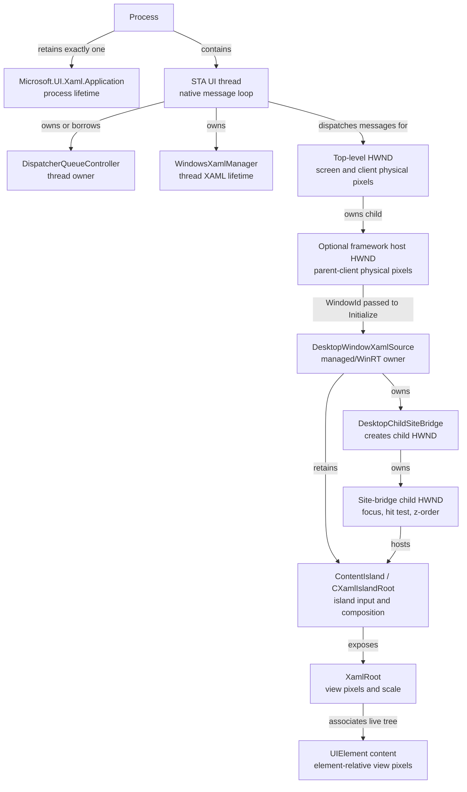
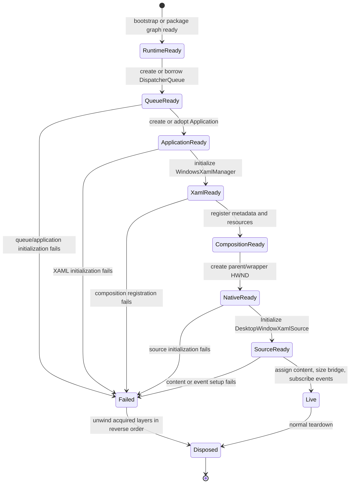
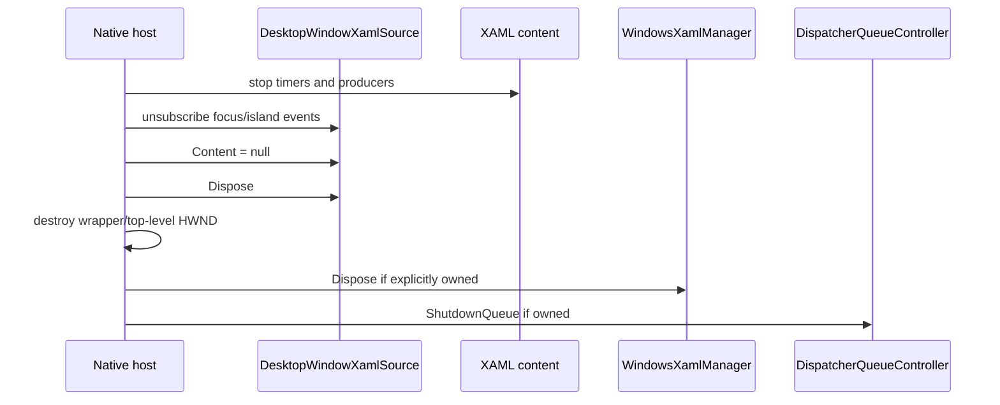
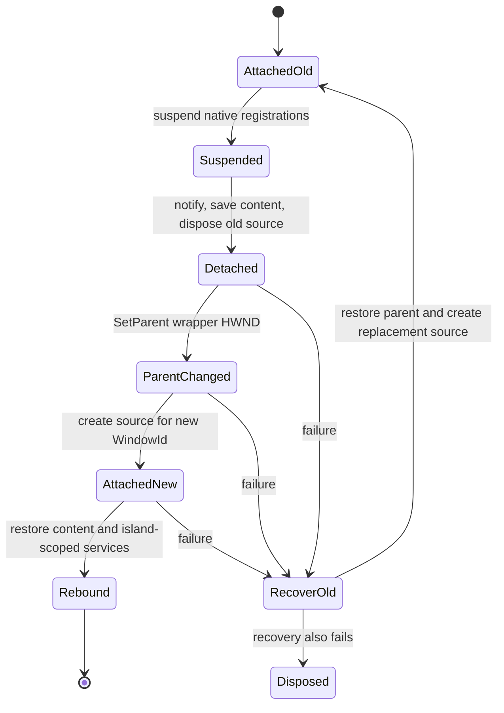

# Host topology and ownership state machine

This guide makes the Win32, Windows App SDK, and XAML ownership boundaries
explicit. Use it when building a reusable host, handling parent destruction,
recovering partial construction, reparenting, or diagnosing late shutdown faults.

## Applies to

- `DesktopWindowXamlSource` in Windows App SDK 1.4 or later.
- Raw Win32, WPF, Windows Forms, MFC, or another HWND-owning desktop framework.
- Packaged and unpackaged applications; runtime bootstrap differs, host topology
  does not.
- One or more islands on one XAML UI thread. A multiple-XAML-thread design needs a
  separate, explicitly validated policy.
- The bundled Windows App SDK 2.3.1 sample in
  [assets/minimal-host](assets/minimal-host/README.md).

## Topology

If no wrapper HWND exists, initialize the source directly against the top-level or
another application-owned child HWND. The important distinction is unchanged: the
application HWND passed to `Initialize` is the parent; the bridge creates a
separate child HWND that receives focus, hit testing, z-order, and native
registrations.

## Ownership table

| Object | Scope and thread | Coordinate boundary | Owner and terminal action |
| --- | --- | --- | --- |
| Runtime bootstrap | Process, before first Windows App SDK API | None | Executable initializes; shutdown after all Windows App SDK objects and threads. |
| `DispatcherQueueController` | Native message-loop thread | None | Message-loop owner shuts down only a controller it created. |
| `Application` | One compatible instance per process | Application resources | Process retains; do not replace after partial construction. |
| `WindowsXamlManager` | XAML-owning thread | Thread XAML tree | Thread environment disposes before queue shutdown. |
| Native parent HWND | Native owner thread | Screen/client physical pixels | Existing framework destroys it. |
| Optional wrapper HWND | Same native thread as parent | Parent-client physical pixels | Reusable host destroys it after XAML state. |
| `DesktopWindowXamlSource` | Host/XAML thread | Connects HWND and island spaces | Host clears content and disposes deterministically. |
| `DesktopChildSiteBridge` | Created by source | Integer parent-client rectangle | Source owns; recreated with source. |
| Site-bridge HWND | Native child of initialization target | Physical pixels | Bridge owns; use its `WindowId` to discover the HWND when required. |
| `ContentIsland` | Island/platform lifetime | Island input/composition space | Source/XAML root owns; reacquire scoped services after replacement. |
| `XamlRoot` | Live XAML tree | View pixels; exposes rasterization scale | XAML owns; content observes `Changed` and `Loaded`/`Unloaded`. |
| Content `UIElement` | Application policy on XAML thread | Element-relative view pixels | Host may clear without disposing arbitrary application content. |

## Core invariants

1. The dispatcher queue exists before XAML initialization or control creation.
2. The one process `Application` is compatible with every participating library's
   metadata/resource composition contract.
3. Every XAML object is accessed on its owning XAML thread even when its WinRT
   metadata advertises agile marshaling.
4. The source remains strongly referenced while its content is visible.
5. Site-bridge bounds describe physical parent-client pixels; XAML layout remains
   in view pixels.
6. Island-scoped input, composition, drag/drop, and focus objects are not reused
   after source replacement.
7. XAML state is gone before framework/platform queue shutdown.
8. Cleanup can run from explicit disposal, parent destruction, failed
   construction, or dispatcher shutdown without double-dispose failure.

## Initialization state machine

A process application can have irreversible side effects before its constructor
returns. Retain and report partial initialization rather than hiding it by creating
a replacement application.

## Normal close

The host may destroy the top-level HWND after the source is gone, or dispose the
source during `WM_DESTROY` if framework constraints require it. Either path must
converge on the same idempotent state.

## Parent destruction

A parent can be destroyed without managed `Dispose` running first. The wrapper's
native destruction callback must:

1. Mark or detach native registrations that target the site-bridge HWND.
2. Stop callbacks that can re-enter XAML.
3. Clear content and dispose the source.
4. Release environment/host leases.
5. Let base/native destruction continue.

Do not throw a managed exception across a window procedure. Capture operation,
HRESULT, thread, and exception type; restore safe state and return the native
fallback.

## Partial-construction rollback

Track each acquired layer independently. On failure, unwind in reverse order while
preserving the construction exception. If cleanup also fails, report an aggregate
that keeps construction failure first.

A practical acquisition stack is:

1. Environment/queue lease.
2. Source object.
3. Source event handlers.
4. Island-scoped services.
5. Content assignment.
6. Dispatcher-shutdown registration.

Do not call a general public `Dispose` path that assumes construction completed
unless that path explicitly tolerates every partial state.

## Dispatcher shutdown

Dispatcher shutdown is layered:

1. Application shutdown starts; dispose high-level hosts and stop work producers.
2. XAML framework shutdown runs and can raise final `Unloaded` callbacks.
3. Platform objects such as compositor/input/islands shut down.
4. The queue controller completes shutdown.

A host that survives normal parent lifetime should register owner-thread cleanup
at application shutdown. Finalizers cannot safely perform this work.

After XAML has fully shut down on all participating threads, do not attempt to
restart it in the same process.

## Reparenting state machine

`DesktopWindowXamlSource.Initialize` binds the source to a `WindowId`. Calling
`SetParent` on a wrapper HWND does not retarget the existing bridge.

The old and recovered sources are different objects even when recovery returns to
the original parent. Reacquire `InputPointerSource`, drag/drop manager, composition
visuals, focus subscriptions, and any registration HWND. Verify the new site-bridge
HWND differs from the old one.

## Terminal-state test matrix

| Path | Observable terminal state |
| --- | --- |
| Normal close | Content cleared, source disposed, queue shutdown completes, process exits. |
| Parent destroyed first | Host handle invalid, no source or island callbacks survive, process remains stable. |
| Construction fails before source | Queue/application ownership is unchanged or correctly unwound. |
| Source initialization fails | Source disposed; native parent remains usable or wrapper is disposed. |
| Content factory fails | Source/content detached; original exception preserved. |
| Dispatcher shuts down with live host | Host cleanup runs before XAML/platform shutdown; no late callback failure. |
| Reparent succeeds | New source and site bridge, same content policy, scoped services rebound. |
| Reparent fails but recovers | Original parent restored with a replacement source; failure still reported. |
| Reparent and recovery fail | Host disposed; both failures retained. |
| Wrong thread or MTA | Rejected before creating native/XAML state. |

## Failure signatures

| Symptom | Likely ownership defect |
| --- | --- |
| Window is visible but island is blank | Source lost, content cleared, or bridge never sized. |
| Old parent still receives pointer/drop callbacks after reparent | Island-scoped object or HWND registration was reused. |
| `RPC_E_WRONG_THREAD` during shutdown | XAML object touched after framework shutdown or from wrong thread. |
| Second host fails after first is disposed | Last wrapper incorrectly shut down shared thread XAML/queue. |
| Process hangs after last window | Queue/work producer remains active or nested loop did not exit. |
| Crash after process appears closed | Native callback/delegate outlived managed owner or platform shutdown order was reversed. |

## Validation matrix

The bundled sample proves source creation, nonzero bridge sizing, normal close, and
x64/ARM64 compilation. A reusable host still needs subprocess tests for every
terminal state above. Run each process-level XAML scenario in a fresh process;
`Application.Current` and completed XAML shutdown make same-process repetition a
weak oracle.

## Sources

Use the `DesktopWindowXamlSource`, dispatcher-queue, focus, island implementation,
and windowless design-note links in [sources.md](sources.md). Pin WinUI source to
an immutable commit for claims about `CXamlIslandRoot` or bridge internals.

## Known gaps

The stable `DesktopWindowXamlSource` topology is documented here. Lower-level or
windowless `XamlIsland`/`ChildSiteLink` designs can change the HWND boundary and
UIA transform responsibilities; keep them in a separate migration document until
the selected stable package exposes the required APIs.
