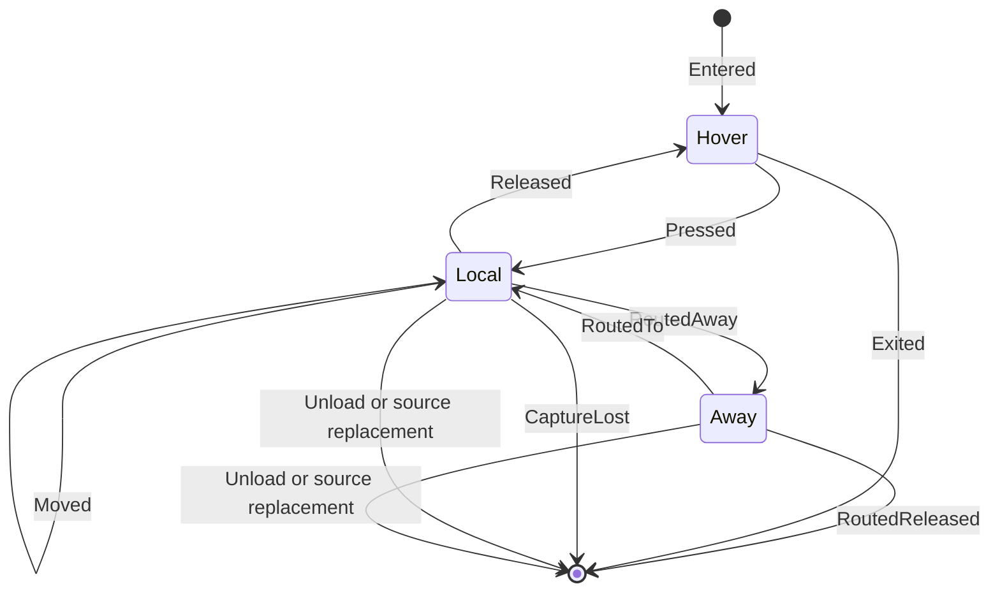

# Island-scoped pointer and cursor behavior

Use this guide when routed XAML pointer events are not enough and an HWND-backed
WinUI host must observe or control input at the `ContentIsland` boundary. Keep
island-level observation additive; do not replace a control's built-in selection,
click, manipulation, or capture behavior unless the application owns the control.

## Applies to

- Windows App SDK 1.7 or later on Windows 10 version 1809 or later.
- Framework-dependent, unpackaged deployment.
- `DesktopWindowXamlSource` content with a live `XamlRoot.ContentIsland`.
- Mouse, touch, and pen input on the XAML-owning STA thread.
- x64 lifecycle and reparenting behavior measured in a consuming framework.
- The consuming framework builds for ARM64; touch and pen remain manual gates.
- API and source-observed behavior checked against Windows App SDK 2.3.1.

`InputPointerSource.GetForIsland` is available in Windows App SDK 1.4, but the
`XamlRoot.ContentIsland` access used by this host recipe begins in 1.7. Re-check
metadata and event contracts before adapting the recipe to another release line.

The [bundled minimal host](assets/minimal-host/README.md) establishes the island
lifecycle but does not attach a lower-level pointer observer or cursor policy.

## Choose the event layer

| Need | Preferred API |
| --- | --- |
| Implement ordinary control interaction | Routed `UIElement` pointer events |
| Get a point relative to a specific element | `PointerRoutedEventArgs.GetCurrentPoint(element)` |
| Observe events handled by a control class | `UIElement.AddHandler(..., handledEventsToo: true)` |
| Observe routing at the whole island boundary | `InputPointerSource.GetForIsland(contentIsland)` |
| Set the cursor for the island input target | `InputPointerSource.Cursor` |
| Build a non-XAML content framework | `ContentIsland` and its input sources directly |

Do not subscribe to `InputPointerSource` merely to avoid routed events. Routed
events preserve element hit testing, transforms, control class handling, and XAML
capture semantics. The lower-level source is useful when the gesture begins before
an element handler can retain the required state, when routing can leave the
island, or when cursor policy belongs to the island.

## Identity and ownership

`InputPointerSource.GetForIsland` supports only an island owned by the calling
thread. It returns null for an invalid or different-thread island. Repeated calls
for one valid island return the same source; only one source is associated with
that island.

At the pinned WinUI source commit, `CXamlIslandRoot` obtains this same source and
subscribes its pointer events to inject routed XAML input. A host subscription is
therefore another observer of a shared source. Do not set the low-level event's
handled state unless the host intentionally owns routing; doing so can change what
XAML receives, and handler ordering is not a stable coordination mechanism.

| Resource | Identity | Ownership rule |
| --- | --- | --- |
| `ContentIsland` | Current `XamlRoot.ContentIsland` | Borrow from the live XAML root; do not cache across source replacement. |
| `InputPointerSource` | One per island | Retain while subscribed; unsubscribe when that island unloads or changes. |
| Original `InputCursor` | Value borrowed from the source | Restore it; do not dispose it. |
| Created `InputSystemCursor` | Application-created object | Restore the original cursor first, then dispose each created cursor. |
| Gesture state | Pointer ID plus host generation | Clear on every terminal event, unload, source replacement, and disposal. |

The source is agile in metadata, but `GetForIsland` still requires the island's
owning thread. Keep XAML event subscription and mutable gesture state on that
thread unless a documented API explicitly supports another model.

## Acquire only after load

An element can exist before it has a `XamlRoot`. Subscribe before it enters the
tree, attach from `Loaded`, and keep the handler until attachment succeeds. If a
loaded element has a root but no usable island yet, enqueue one dispatcher retry;
re-subscribing to `Loaded` from inside its handler does not retry the current load.

```csharp
private InputPointerSource? _inputSource;
private bool _attachRetryQueued;
private bool _disposed;
private long _attachmentGeneration;

private void ElementLoaded(object sender, RoutedEventArgs eventArgs)
{
    FrameworkElement element = (FrameworkElement)sender;
    if (_disposed)
    {
        return;
    }

    element.Unloaded -= ElementUnloaded;
    element.Unloaded += ElementUnloaded;
    if (TryAttach(element))
    {
        element.Loaded -= ElementLoaded;
        return;
    }

    if (_attachRetryQueued)
    {
        return;
    }

    long generation = _attachmentGeneration;
    _attachRetryQueued = true;
    if (!element.DispatcherQueue.TryEnqueue(() =>
    {
        if (_disposed || generation != _attachmentGeneration)
        {
            return;
        }

        _attachRetryQueued = false;
        if (element.IsLoaded && TryAttach(element))
        {
            element.Loaded -= ElementLoaded;
        }
    }))
    {
        if (generation == _attachmentGeneration)
        {
            _attachRetryQueued = false;
        }
    }
}

private bool TryAttach(FrameworkElement element)
{
    if (_disposed)
    {
        return false;
    }

    if (_inputSource is not null)
    {
        return true;
    }

    if (!element.IsLoaded
        || element.XamlRoot?.ContentIsland is not { } contentIsland)
    {
        return false;
    }

    InputPointerSource? inputSource = InputPointerSource.GetForIsland(contentIsland);
    if (inputSource is null)
    {
        return false;
    }

    inputSource.PointerPressed += InputSourcePointerPressed;
    inputSource.PointerCaptureLost += InputSourcePointerEnded;
    inputSource.PointerRoutedAway += InputSourcePointerRoutedAway;
    inputSource.PointerRoutedReleased += InputSourcePointerEnded;
    element.Unloaded += ElementUnloaded;
    _inputSource = inputSource;
    return true;
}

private void ElementUnloaded(object sender, RoutedEventArgs eventArgs)
{
    FrameworkElement element = (FrameworkElement)sender;
    InvalidatePendingAttach();
    DetachInputSource(element);
    if (!_disposed)
    {
        element.Loaded -= ElementLoaded;
        element.Loaded += ElementLoaded;
    }
}

private void DisposeInputServices(FrameworkElement element)
{
    _disposed = true;
    InvalidatePendingAttach();
    element.Loaded -= ElementLoaded;
    DetachInputSource(element);
}

private void InvalidatePendingAttach()
{
    _attachmentGeneration++;
    _attachRetryQueued = false;
}
```

`DetachInputSource` removes every source and routed handler, restores the borrowed
cursor, disposes owned cursors, removes `ElementUnloaded`, clears `_inputSource`,
and resets gesture state. Source replacement and unload increment the attachment
generation; terminal cleanup sets `_disposed` before doing the same. The one queued
retry checks those values and `IsLoaded`, so it cannot attach after invalidation.
A false `TryEnqueue` result means dispatcher shutdown has begun, so do not create
another queue merely to finish attachment. If the retry cannot attach, the
retained `Loaded` handler tries again only after a later unload/reload cycle.

Make attachment transactional. If any subscription or cursor creation throws,
unsubscribe everything already attached, restore the original cursor, dispose
owned cursors, and clear the cached source before propagating the failure.

## Event state machine

Under the documented normal path, one pointer ID produces:

```text
PointerEntered -> PointerPressed -> PointerMoved* -> PointerReleased -> PointerExited
```

`PointerMoved` occurs only when position or mouse button state changes. Capture
loss is a terminal path:

```text
PointerEntered -> PointerPressed -> PointerMoved* -> PointerCaptureLost
```

After `PointerCaptureLost`, the source does not raise `PointerReleased` or
`PointerExited` for that pointer. Routing to another input target has two forms:

```text
PointerRoutedAway -> PointerRoutedTo -> ... -> PointerReleased -> PointerExited
PointerRoutedAway -> PointerRoutedReleased
```

`PointerRoutedReleased` is terminal and is not followed by `PointerReleased` or
`PointerExited`. A target can also first see an already-contacting pointer through
`PointerEntered`, `PointerPressed`, then `PointerRoutedTo`.

Treat these as a state machine keyed by `PointerId`, not as independent mouse
events. A single boolean such as `isPressed` cannot represent concurrent touch
contacts or a pointer routed away while another remains local.



## Coexist with class handling

Controls such as text editors handle pointer events internally and may mark them
handled or capture the pointer. An ordinary C# event subscription can therefore
miss the movement or release needed to finish observation.

Use `AddHandler` with `handledEventsToo: true` when observation is required:

```csharp
element.AddHandler(
    UIElement.PointerMovedEvent,
    pointerMovedHandler,
    handledEventsToo: true);
element.AddHandler(
    UIElement.PointerReleasedEvent,
    pointerEndedHandler,
    handledEventsToo: true);
element.AddHandler(
    UIElement.PointerCanceledEvent,
    pointerEndedHandler,
    handledEventsToo: true);
element.AddHandler(
    UIElement.PointerCaptureLostEvent,
    pointerEndedHandler,
    handledEventsToo: true);
```

Remove each handler with the same routed event and delegate during detach. An
observer must not set `Handled=true` merely because it saw a class-handled event;
that can change selection, click, or manipulation behavior for other handlers.

Do not assume a fixed ordering between `InputPointerSource` and control class
handlers unless the exact package and control have been measured. When combining
layers, use the low-level event only for the fact it uniquely supplies, then let
the routed path own the rest of the gesture.

## Pointer capture

Use XAML capture (`CapturePointer`, `ReleasePointerCapture`, or
`ReleasePointerCaptures`) when a XAML element owns the gesture. Check the capture
result and handle release, cancellation, and capture loss.

Before handing a gesture to classic OLE `DoDragDrop`, release XAML pointer capture.
OLE then owns cursor tracking through its nested loop. Revalidate the element,
island, selection, and host generation after the call returns.

Never wait for only `PointerReleased`. Reset gesture state on:

- routed `PointerReleased` and `PointerCanceled`;
- routed `PointerCaptureLost`;
- source `PointerCaptureLost`;
- source `PointerRoutedReleased`;
- unload, island replacement, and host disposal.

`PointerRoutedAway` is not necessarily terminal because the pointer can route
back. A gesture may deliberately cancel at that boundary, but the pointer state
machine must still accept a later `PointerRoutedTo` or `PointerRoutedReleased`
without double cleanup.

## Cursor ownership

`InputPointerSource.Cursor` controls the cursor shown for a mouse or pen over that
input target. A robust override follows this order:

1. Save the current cursor without taking ownership.
2. Create the required `InputSystemCursor` instances.
3. Assign an owned cursor only while the policy applies.
4. Restore the saved cursor on exit, detach, or failure.
5. Dispose the application-created cursors after they are no longer assigned.

```csharp
InputCursor originalCursor = inputSource.Cursor;
InputSystemCursor arrowCursor =
    InputSystemCursor.Create(InputSystemCursorShape.Arrow);
try
{
    inputSource.Cursor = arrowCursor;
}
finally
{
    inputSource.Cursor = originalCursor;
    arrowCursor.Dispose();
}
```

Do not dispose the borrowed original cursor. Do not dispose an owned cursor while
it is still assigned. If a control class updates the cursor during its routed
handler, apply an application override after that handler only when measured
behavior requires it; otherwise let the control own its cursor.

Touch has no hover cursor. Pen hover and mouse can use cursor state, while contact
and capture behavior differ by device. Keep cursor policy separate from gesture
state so a touch contact cannot accidentally retain a mouse-specific cursor.

For built-in `CanDrag` behavior, the pinned WinUI source detects mouse and pen
movement against a drag rectangle, while touch waits for a holding/direct-
manipulation path. Do not apply a mouse movement threshold to every device or
assume touch and pen produce the same event sequence.

## Coordinates and device state

`InputPointerSource` reports a `PointerPoint` for its input target. Treat
`PointerPoint.Position` as island/input-target coordinates, not coordinates
relative to an arbitrary XAML element. For element interaction, use
`PointerRoutedEventArgs.GetCurrentPoint(element)`.

Record these fields together in diagnostics:

- `PointerId`;
- device type and supported `DeviceKinds`;
- position plus its named origin and unit;
- contact, primary, and button properties;
- wheel delta when applicable;
- current island ID, host generation, and rasterization scale.

Do not convert view coordinates to physical pixels unless crossing into a native
API. Use the live island/root scale and the conversion rules in
[dpi-and-coordinate-spaces.md](dpi-and-coordinate-spaces.md).

## Transparent and disabled islands

When input unexpectedly disappears, inspect the island state before changing
event handlers:

- `IsIslandEnabled` and `IsIslandVisible`;
- `IsSiteEnabled` and `IsSiteVisible`;
- `ProcessesPointerInput`;
- `IsHitTestVisibleWhenTransparent` when the island has no visible content;
- connection and closed state.

These are island/site gates. They do not prove that a particular XAML element is
hit-test visible, enabled, unclipped, or above another HWND.

## Reparenting and teardown

Replacing a `DesktopWindowXamlSource` can replace the `XamlRoot.ContentIsland`
even when the same XAML element is reused. Detach before clearing or moving the
content:

1. Stop accepting new gestures.
2. Remove source and routed-event handlers.
3. Restore the original cursor.
4. Dispose created cursor objects.
5. Clear all pointer-ID state.
6. Replace or dispose the XAML source.
7. Reattach from `Loaded` after the replacement island is live.

Make detach idempotent. Parent destruction, element unload, reparenting rollback,
and dispatcher shutdown can converge on the same cleanup method.

## Callback failure containment

Lower-level pointer handlers sit on a native input path. Catch exceptions at that
boundary, clear gesture state for the affected pointer, and report through a
bounded host diagnostic channel. Do not let logging, cursor assignment, stale
element access, or a failed coordinate conversion prevent terminal cleanup.

Callbacks can synchronously run application code that unloads content or destroys
the host. Capture only the minimum identity needed before calling out, then
revalidate the island ID, host generation, and element loaded state afterward.
Ignore events from a detached generation instead of mutating replacement content.

## Failure signatures

| Symptom | First discriminating check |
| --- | --- |
| `GetForIsland` returns null | Verify a live `ContentIsland` and same-thread call. |
| Press arrives but release never does | Log capture loss, routed-away, and routed-released terminal events by pointer ID. |
| Works until reparenting | Compare old/new island IDs and confirm detach/reattach around source replacement. |
| Text selection breaks | Check for ordinary subscriptions missing class-handled events or an observer setting `Handled`. |
| Cursor remains after unload | Verify original-cursor restoration occurs before owned cursor disposal. |
| Cursor flickers between shapes | Identify whether the control class and island observer both assign the cursor. |
| Touch works like a single mouse | Replace global pressed state with per-pointer-ID state and test simultaneous contacts. |
| Coordinates drift with DPI | Name the source coordinate space and query the live root/island scale. |
| Transparent island receives no input | Inspect visible content and `IsHitTestVisibleWhenTransparent`. |

## Validation matrix

| Scenario | Mouse | Touch | Pen |
| --- | --- | --- | --- |
| Enter, press, move, release, exit | Automated trace plus manual | Manual | Manual |
| XAML capture and release | Automated trace plus manual | Manual multi-contact | Manual barrel/eraser policy |
| Capture lost | Automated forced transfer | Manual | Manual |
| Routed away, back, and released away | Controlled multi-target test | Manual | Manual |
| Cursor set, class override, and restore | Manual screenshot/event log | N/A | Manual hover |
| Unload/reload | Automated identity and subscription counts | Manual | Manual |
| Reparent to a new island | Automated old/new identity and stale-event rejection | Manual | Manual |
| Two simultaneous islands | Automated pointer/source correlation | Manual | Manual |
| 100%, 150%, and 200% DPI | Coordinate assertions plus manual | Manual | Manual |

Run real-window tests out of process. Record event name, pointer ID, device,
island ID, host generation, position, buttons, capture state, and cursor shape.
Assert one terminal transition per pointer and no callbacks from a detached island.

The portable skill has no bundled pointer-routing harness. Treat touch, pen,
cross-island routing, and cursor restoration as pending until a consuming
framework retains traces for the matrix.

## Sources

Use the `InputPointerSource`, `ContentIsland`, pointer capture, and input entries
in [sources.md](sources.md). Keep measured ordering separate from the public API's
documented event sequences.

## Known gaps

High-frequency/coalesced movement, direct manipulation, custom cursor image
scaling, accessibility pointer alternatives, remote desktop, display rotation,
and cross-process routed pointers need dedicated validation before prescriptive
claims.
