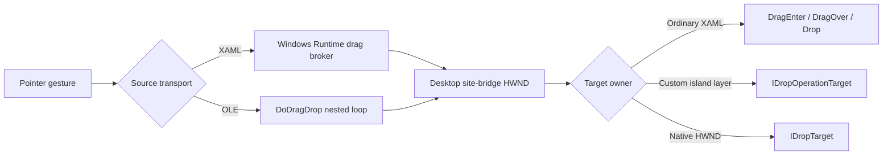
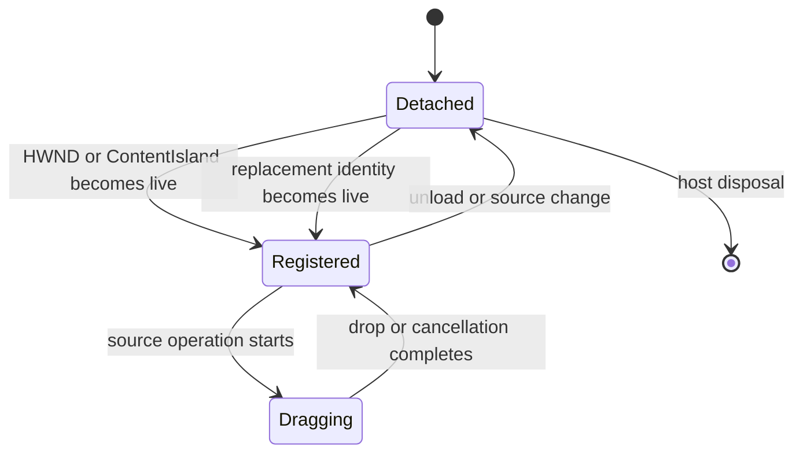

# Mixed OLE and XAML drag/drop

Use this guide when a Win32 host must move data between native HWND content and
WinUI controls in a `DesktopWindowXamlSource`. Keep gesture detection, transport,
target routing, visual feedback, and data mutation as separate decisions.

## Applies to

- Windows App SDK 1.7 or later, framework-dependent unpackaged applications on
  Windows 10 version 1809 or later.
- .NET 10 on an STA thread with an HWND-backed WinUI island.
- Routed XAML drag/drop, the Windows Runtime drag broker, and classic OLE
  `DoDragDrop` interoperability.
- x64 behavior measured in a consuming framework; ARM64 builds but mixed transfer
  behavior remains a manual gate.
- API and source-observed behavior checked against Windows App SDK 2.3.1.

The drag/drop primitives described here begin in Windows App SDK 1.4, but the
`XamlRoot.ContentIsland` access used by this host recipe begins in 1.7.

The [bundled minimal host](assets/minimal-host/README.md) does not implement
drag/drop. Use it to establish the host lifecycle, then add one drag layer at a
time.

## Choose one target owner

| Scenario | Source | Target |
| --- | --- | --- |
| Ordinary WinUI controls | `UIElement.StartDragAsync` or `CanDrag` plus `DragStarting` | `AllowDrop` and routed XAML drag events |
| Native source into ordinary WinUI | OLE or another system drag source | Routed XAML drag events through the platform bridge |
| WinUI source into native HWNDs | XAML drag for standard system transfer; OLE when classic source feedback is required | Native `IDropTarget` |
| Custom island framework | `DragOperation` | One `DragDropManager.TargetRequested` owner and `IDropOperationTarget` |
| Native-only HWND surface | OLE `DoDragDrop` | OLE `RegisterDragDrop` and `IDropTarget` |

At the source commit pinned in [sources.md](sources.md), `CXamlIslandRoot`
acquires a `DragDropManager` when its island connects, installs one
`TargetRequested` handler, and removes that handler when the island disconnects.
`UIElement.StartDragAsync` retrieves the manager retained by that root. This is
source-observed behavior, not a public extension point or documented restriction
on `GetForIsland`. The ownership guidance below is inferred from that architecture
and must be rechecked when the package changes. Do not acquire another manager
merely to customize ordinary XAML content. A custom manager is appropriate when
the application intentionally owns target routing for a non-XAML island framework.

## Topology and ownership

| Resource | Owner | Required cleanup |
| --- | --- | --- |
| Source `DataPackage` | Drag operation | Do not retain callback-only views beyond their contract. |
| OLE `IDataObject*` received by a callback | Caller for callback duration unless explicitly AddRef'd | Release any acquired reference and every owned `STGMEDIUM`. |
| Native drop registration | HWND owner thread | Call `RevokeDragDrop` before handle destruction or replacement. |
| `DragDropManager` event subscription | Custom island framework | Remove the handler when the `ContentIsland` unloads or changes. |
| Drop feedback visual | Target content | Remove it on leave, drop, unload, cancellation, and failure. |

Registration follows identity, not wrapper-object lifetime. Reparenting that
replaces either the native target HWND or the `ContentIsland` requires revoking
the old registration and binding the replacement after it is live.

## Routed XAML path

For ordinary content:

1. Start a drag through `UIElement.StartDragAsync` or a `CanDrag` gesture.
2. Populate `DragStartingEventArgs.Data` and set `RequestedOperation`.
3. Set `AllowDrop=true` on the target.
4. Set `AcceptedOperation` during `DragOver`.
5. Read `DataView` asynchronously during `Drop`.
6. Use `DragEventArgs.GetPosition(target)` for target-relative feedback.

Do not reinterpret an island-level position as an element-relative point. The
target element may be translated, scrolled, mirrored, or scaled inside the root.
Give an `AllowDrop` target a non-null background, using `Transparent` when it
should receive pointer hit testing without visible fill.

`UIElement.StartDragAsync` is not supported in an elevated process. Treat process
elevation as a deployment constraint, not as an input bug to repair with a second
island manager.

## Classic OLE path

Classic OLE is appropriate when native targets require conventional source
feedback or when the application already owns an `IDataObject`/`IDropSource`
pipeline.

1. Balance every successful `OleInitialize` result (`S_OK` or `S_FALSE`) with `OleUninitialize`.
2. Build `FORMATETC` and `STGMEDIUM` values with explicit format, aspect, index,
   tymed, allocator, and release ownership.
3. Call `DoDragDrop` on the STA owner thread.
4. Treat the call as synchronous but reentrant: it runs a nested message loop.
5. Complete a move only when the returned effect is Move and the destination
   commit succeeded.

Every COM callback must translate managed exceptions to an HRESULT. Do not let an
exception cross the unmanaged boundary. Bound external format enumeration and
payload sizes before allocating or decoding.

`RegisterDragDrop` requires OLE initialization and a message-pumping owner thread;
initializing only with `CoInitialize`/`CoInitializeEx` is insufficient. The call
adds a reference to the target, and `RevokeDragDrop` releases it.

Register an OLE target only on an HWND the application owns as a native target.
It must be the window that receives drag hit testing, not an obscured wrapper or
top-level parent. Do not register over the site-bridge HWND already owned by XAML's
drag manager; `DRAGDROP_E_ALREADYREGISTERED` is an ownership collision, not a cue
to replace the existing target. Use routed XAML events for that surface or create a
separate native child target with explicit z-order and bounds. Validate a native
candidate with `IsWindow`, its owning process and thread, and the current host
generation before registration.

Classic `DoDragDrop` does not directly support initiation from touch or pen
handlers. Follow its documented synthesized-mouse path when classic OLE is the
required transport; prefer XAML drag APIs for native touch/pen gestures.

## Nested-loop rules

`DoDragDrop` does not return until drop or cancellation. During that interval:

- window messages and COM calls can reenter application code;
- the source selection, source HWND, island, and dispatcher can be invalidated;
- teardown must request cancellation or defer destructive work rather than
  releasing callback state underneath OLE;
- completion code must revalidate every object captured before the call;
- no lock needed by a callback may be held across `DoDragDrop`.

Model the drag session as one state transition with one terminal completion. Late
leave, capture-loss, or cancellation notifications must not commit or clean up a
second time.

At the pinned WinUI source commit, `DropOperationTarget` queues drag callbacks
that reenter while a prior callback is reading cross-process `DragInfo`. It also
tracks the active target per thread because leave from one island is not guaranteed
to precede enter/over for the next. A custom target must not assume perfectly
nested enter/leave ordering across islands; make enter replace stale target state
and make a late leave idempotent.

## Editable-text move transaction

WinUI `TextBox` and `RichEditBox` do not expose a complete native-editor selected
text drag contract. Application code must preserve editing semantics explicitly:

1. Snapshot a nonempty selection and the source generation.
2. Begin only when the press is inside that selection.
3. Preserve ordinary click, double-click, and selection behavior elsewhere.
4. Offer Move by default and Copy when the modifier policy permits it.
5. Reject a same-control move into the source range.
6. Insert and select the destination text first.
7. Delete the original only after a successful Move; adjust source indices when
   insertion occurred before the original range.
8. Restore selection and focus after cancellation or failed commit.

For cross-control moves, the target commit and source deletion are separate
operations. Record enough source state to detect intervening edits before deleting
text. If the source generation changed, keep the inserted copy and do not delete
an unverified range.

## Target feedback

Keep transport feedback separate from editor feedback. `DragUIOverride.Clear`
controls broker-owned content, glyph, and caption while a cooperating target owns
the override; it does not suppress every source visual over native targets.

A composition child visual can draw a text insertion caret without modifying the
editor's XAML tree. Resolve its brush from the active theme, use target-relative
view coordinates, snap physical edges with the live rasterization scale, and
remove the visual on every terminal path.

## Lifecycle sequence

For native reparenting, revoke the old HWND before changing it. For XAML source
replacement, detach the manager and feedback visual before clearing content, then
reacquire from the replacement `XamlRoot.ContentIsland` after load.

## Security and callback safety

Treat every incoming data object as untrusted, including drags originating in the
same process. Before reading a format:

- allowlist the format, `DVASPECT`, `lindex`, and `TYMED` combinations the target
  supports;
- cap format enumeration, item count, stream length, decoded text length, and
  total allocation;
- validate `HGLOBAL` size before locking or scanning it, and keep byte/character
  arithmetic checked;
- release every successfully returned `STGMEDIUM` exactly once with
  `ReleaseStgMedium`;
- copy data needed after a callback, or explicitly `AddRef` a retained COM
  interface and release it on every terminal path;
- reject stale HWND, island, source-generation, and target-generation values
  before mutation.

Initialize an outgoing effect to None before invoking application code. Native
callbacks validate required pointers and catch all managed exceptions, reset
session state, and return an appropriate failure HRESULT. WinRT async target
methods return `DataPackageOperation.None` after contained failures. Do not expose
exception text or arbitrary external payloads through an unbounded diagnostic
channel.

## Failure signatures

| Symptom | First discriminating check |
| --- | --- |
| XAML `Drop` never runs | Confirm `AllowDrop`, accepted operation, and that no custom manager replaced XAML's target owner. |
| Native target never activates | Compare the registered HWND with the site-bridge HWND under the pointer. |
| Drag works until reparenting | Log registration HWND and `ContentIsland` identity before and after replacement. |
| Move duplicates or deletes wrong text | Log destination commit, returned effect, source generation, and adjusted deletion range. |
| UI freezes during drag | Find a lock held across `DoDragDrop` or work synchronously performed by a callback. |
| Crash during shutdown | Check whether registration, callbacks, or feedback outlived the HWND/island environment. |
| Caret offset changes with DPI | Compare `GetPosition(target)`, target transform, and live `RasterizationScale`. |
| Source visual differs over native targets | Determine whether the active transport is XAML broker drag or classic OLE. |
| Memory rises with malformed data | Log format/item/byte limits and verify every acquired medium or interface is released. |

## Validation matrix

Run each supported direction with Copy, Move, cancellation, invalid data, and
teardown where applicable:

| Source | Target | Required checks |
| --- | --- | --- |
| WinUI text | WinUI text, same island | Selection preservation, overlap rejection, Copy/Move, caret. |
| WinUI text | WinUI text, another island | Island identity, coordinates, source deletion after commit. |
| Native text | WinUI text | OLE-to-XAML bridge, format bounds, target-relative point. |
| WinUI text | Native text | Native target feedback, returned effect, cancellation. |
| Native text | Native text | Baseline OLE ownership and reentrancy. |

Repeat after reparenting and at 100%, 150%, and 200% display scale. Add parent
destruction during an active drag in a subprocess with a timeout and process-tree
cleanup. Retain lifecycle events and final source/target text for failures.

The portable skill has no bundled end-to-end mixed-transfer harness. Treat the
matrix as pending until a consuming framework records real-window results.

## Sources

Use the drag/drop, content-island, OLE, and WinUI implementation entries in
[sources.md](sources.md). Implementation observations must remain pinned to the
source commit recorded there.

## Known gaps

Touch/pen source gestures, shell virtual files, promised data, cross-integrity
drags, accessibility announcements, remote desktop, and drag-image parity across
native and XAML targets need dedicated validation before prescriptive claims.
