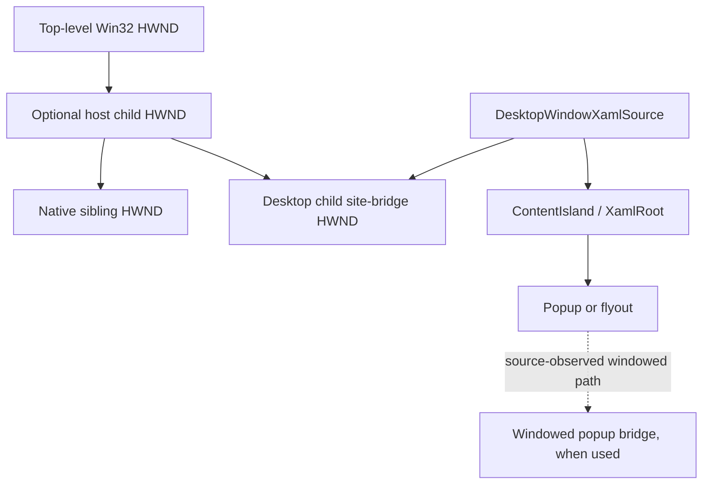

# Popup, airspace, and z-order

Use this guide when hosted XAML clips incorrectly, a native control cannot appear
above or below the island, or a flyout opens on the wrong root, monitor, or work
area. Diagnose ownership, coordinate space, clipping, and z-order independently;
changing one does not establish the others.

## Applies to

- `DesktopWindowXamlSource` in Windows App SDK 1.5 or later.
- HWND-backed WinUI content in packaged or unpackaged desktop applications.
- Native child/sibling HWNDs, XAML popups and flyouts, and popup site bridges.
- Per-Monitor V2 hosts on Windows 10 version 1809 or later.
- API and source-observed behavior checked against Windows App SDK 2.3.1.
- x64 airspace and clipping behavior measured in a consuming framework; ARM64,
  mixed-monitor popup edges, and accessibility magnification remain manual gates.

The [bundled minimal host](assets/minimal-host/README.md) establishes one island
that fills its parent. It does not include overlapping native siblings or popup
pixel assertions.

## Four independent contracts

| Contract | Governing state | Cheapest discriminating check |
| --- | --- | --- |
| Ownership | Parent/owner HWND, `XamlRoot`, site bridge, popup bridge | Log stable identities and native parent/owner relationships. |
| Coordinates | Origin, unit, DPI scale, transform | Log source and converted rectangles together. |
| Clipping | Parent client bounds, sibling clip styles, XAML clip | Move one child partly outside the parent and sample both sides of the edge. |
| Z-order | Native sibling order or XAML visual order | Sample a known overlap pixel after changing only one ordering layer. |

Do not use a successful focus change as proof of visual order. Do not use HWND
enumeration order as proof of composited pixels. Keep one observable for each
contract.

## Topology



The site bridge is a native child window even though its pixels are produced by
the compositor. A native child that overlaps it participates in HWND airspace.
XAML elements inside the island participate in one XAML visual tree. These are
different ordering domains.

At the WinUI source commit pinned in [sources.md](sources.md), windowed XAML
popups can use a popup content island and desktop popup site bridge. Treat that as
source-observed architecture. Do not depend on the number, class name, or timing
of internal popup HWNDs as a public contract.

## Associate every XAML popup with one root

A popup-like control must resolve the island that owns its resources, scale,
coordinates, input, and accessibility. Prefer opening it from a live element in
the intended tree. When the popup cannot infer its root, assign the live target's
`XamlRoot` explicitly before opening:

```csharp
if (target.XamlRoot is not { } xamlRoot)
{
    throw new InvalidOperationException("The popup target is not loaded.");
}

popup.XamlRoot = xamlRoot;
popup.IsOpen = true;
```

Do not cache a root across unload, reparenting, or source replacement. A reused
content element can acquire a different `XamlRoot` and `ContentIsland`. Close or
detach popup state before clearing source content, then bind the replacement only
after the target loads in its new root.

`DesktopWindowXamlSource.ShouldConstrainPopupsToWorkArea` begins in Windows App
SDK 1.5. It selects whether popup-like content should remain within the monitor
work area, defaults to `true`, and does not change a popup that is already open.
Set it deliberately before opening popups. A flyout constrained to root bounds
takes that tighter constraint instead. Validate both near-edge placement and
keyboard access; a constrained popup can shift away from its nominal target.

## Native z-order

For overlapping native children, order the actual sibling HWNDs. `Canvas.ZIndex`,
panel child order, and composition visual order cannot place one HWND above or
below another HWND.

1. Resolve the current site-bridge HWND from `source.SiteBridge.WindowId` and
   `Win32Interop.GetWindowFromWindowId`.
2. Verify both windows are valid, belong to the expected process/thread, and have
   the intended common parent.
3. Use `SetWindowPos` with an insert-after HWND or documented sentinel.
4. Include `SWP_NOMOVE | SWP_NOSIZE | SWP_NOACTIVATE` when changing only order.
5. Reapply the policy after a source replacement because the bridge HWND identity
   can change.

Do not use `HWND_TOPMOST` to solve ordinary child-sibling ordering. Topmost state
belongs to top-level window bands and can create activation and ownership defects.
Do not call `SetForegroundWindow` as a visual-order repair.

Changing z-order should not change focus, activation, size, or position. Record
all four before and after the operation so a passing screenshot cannot hide a
behavioral regression.

## Parent and sibling clipping

Native clipping is established by window hierarchy and class/window styles:

- `WS_CLIPCHILDREN` prevents a parent from painting over areas occupied by child
  windows.
- `WS_CLIPSIBLINGS` prevents sibling child windows from painting into each
  other's regions during native painting.
- Neither style defines which sibling is above the other.
- Child windows remain clipped to their parent client area, including when their
  coordinates are negative or their bounds extend past an edge.

Use the styles consistently on a host designed for overlapping children. Test
without assuming they repair an already-invalid parent/child topology.

XAML clipping is separate. A XAML `Clip`, scroll viewport, or layout boundary
cannot clip an independent native sibling. Likewise, changing a native window
region does not establish the intended XAML layout clip.

## Coordinates and negative positions

Keep native geometry in physical parent-client pixels. `DesktopSiteBridge`
`MoveAndResize` accepts an integer rectangle in its native parent coordinate
space. XAML layout and popup target geometry use view/effective pixels.

When positioning a native overlay from XAML geometry:

1. Transform both rectangle corners to the XAML root.
2. Multiply by the live `XamlRoot.RasterizationScale`.
3. Round once at the native boundary.
4. Add or subtract the named HWND client origin as required.
5. Preserve signed coordinates.

Use [dpi-and-coordinate-spaces.md](dpi-and-coordinate-spaces.md) for the full
conversion rules. Do not pack negative screen coordinates into unsigned words.

A useful clipping fixture places a child at a negative parent-client x coordinate
and gives it a width that crosses x=0. The visible part must render inside the
parent; the hidden part must not appear outside it. This proves actual parent
clipping rather than a coincidentally small child.

## Reparenting and source replacement

Treat the site bridge and popup association as generation-bound resources:

1. Close owned popups and stop accepting new overlay requests.
2. Remove screenshot/UIA observers tied to the old generation.
3. Record and clear the old site-bridge HWND.
4. Detach or dispose the old XAML source.
5. Change the native parent according to the host's rollback contract.
6. Create and initialize the replacement source.
7. Restore content, wait for load, and query the replacement root/bridge.
8. Reapply size, z-order, clipping, popup policy, and observers.

If replacement fails, either restore a complete original generation or enter one
documented disposed state. Do not retain a popup root from one generation while
using a bridge HWND from another.

## Screenshot pixel oracle

Window enumeration proves topology; a screen capture proves the composed result.
Use both.

Build a deterministic scene with opaque, theme-independent test colors:

- XAML-only region;
- native-only region;
- native-over-XAML overlap;
- XAML-over-native overlap after reversing sibling order;
- child region visible inside the parent clip;
- corresponding region outside the parent clip;
- popup content near each relevant work-area edge.

For each capture:

1. Wait for a versioned `capture-ready` event emitted after layout and z-order
   application; do not use a fixed sleep as readiness.
2. Validate the reported HWND belongs to the scenario process and expected
   thread.
3. Capture the visible screen rectangle so DWM/composition and native airspace
   are both represented.
4. Sample points away from text, borders, shadows, rounded corners, and
   anti-aliased edges.
5. Compare RGB channels with a documented tolerance; a tolerance around 12 can
   absorb minor color conversion without accepting a different surface.
6. Retain the full PNG, sample coordinates, expected/actual values, bounds,
   scale, z-order identities, and OS/runtime versions on failure.

Include a nonblank sanity check such as bounded unique-color sampling, but do not
substitute it for known-color assertions. A nonblank screenshot can still show
the wrong window.

## Popup validation

Exercise each popup type the product uses:

- target loaded in the primary island;
- detached construction followed by explicit `XamlRoot` assignment;
- target near all monitor work-area edges;
- work-area constraint enabled and disabled when supported by policy;
- parent at negative virtual-screen coordinates;
- parent moved between distinct DPI scales;
- native sibling above and below the island;
- source replacement while the popup is closed;
- attempted open during teardown, which must be rejected cleanly;
- keyboard, pointer, focus return, and Escape dismissal.

Validate the popup's pixels and interaction. A correctly placed image with focus
left in a hidden or destroyed HWND is still a failure.

## Failure signatures

| Symptom | First discriminating check |
| --- | --- |
| Flyout reports a missing root | Verify the target is loaded and the assigned `XamlRoot` is current. |
| Popup opens on the wrong monitor | Log target screen rect, root scale, work area, and popup constraint policy. |
| Native sibling cannot cover XAML | Compare actual parent HWNDs and native sibling order; ignore `Canvas.ZIndex`. |
| Parent paint streaks over the island | Check `WS_CLIPCHILDREN`, invalidation, and whether painting targets the parent behind a child. |
| Siblings draw through each other | Check `WS_CLIPSIBLINGS`, regions, and actual z-order independently. |
| Overlay fix steals focus | Check `SetWindowPos` flags and remove activation/foreground calls. |
| Correct at 100%, offset elsewhere | Identify the raw/view conversion and query the live root scale. |
| Correct until reparenting | Compare old/new bridge HWND and root identities and reapply generation-bound policy. |
| Screenshot assertion changes with theme | Replace product theme colors with explicit oracle colors in the test scene. |
| Popup is clipped like ordinary content | Determine whether the popup is inline/composited or uses a separate popup bridge. |

## Validation matrix

| Area | Automated evidence | Manual evidence |
| --- | --- | --- |
| Native/XAML overlap | Known-color samples in both sibling orders | Interactive resize and activation check |
| Parent clipping | Negative child coordinates with visible/hidden samples | Snap, maximize, restore |
| Popup root | Root identity and successful open/dismiss | Every popup/flyout/menu type |
| Work-area policy | Edge-position bounds and pixels | Taskbar locations and auto-hide |
| DPI | Bounds/scale diagnostics and pixel samples | 100%-300% ordered monitor pairs |
| Reparenting | Old/new identity and policy reapplication | Popup interaction after replacement |
| Accessibility | Popup appears in bounded UIA capture | Keyboard, Narrator, magnifier |

The portable skill has no bundled airspace/popup harness. Keep screenshot and
mixed-monitor matrices pending until a consuming framework retains the artifacts
described above.

## Sources

Use the popup, site-bridge, z-order, clipping, screenshot, and DPI entries in
[sources.md](sources.md). Keep public API guarantees separate from internal popup
bridge observations.

## Known gaps

Windowed versus compositor-only popup selection, DWM color management, HDR,
remote desktop, magnifier transforms, taskbar auto-hide edges, and RTL native
window layouts require dedicated measurements before prescriptive claims.
