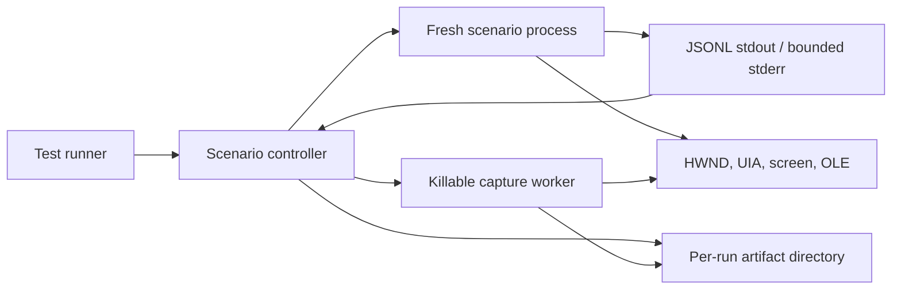

# Testing and diagnostics runbook

Use this runbook when a WinUI-in-Win32 host needs reproducible integration tests
or fails only under a particular machine, architecture, lifecycle, input, DPI,
popup, accessibility, or drag/drop condition. Run real-window scenarios out of
process and make the last completed ownership stage the primary diagnostic.

## Applies to

- `DesktopWindowXamlSource` in Windows App SDK 1.4 or later.
- .NET desktop scenario executables and test controllers on Windows.
- Packaged and unpackaged deployment models, with separate payloads when required.
- x64 and ARM64 builds; execution evidence must name the actual runner architecture.
- API and source-observed behavior checked against Windows App SDK 2.3.1.
- A consuming framework measured with bounded JSONL events, process-tree cleanup,
  screenshots, UI Automation snapshots, and retained result JSON.

The [bundled minimal host](assets/minimal-host/README.md) is the raw lifecycle
oracle. It is build-tested but is not itself a complete integration harness.

## Harness topology



Use a fresh child process for every lifecycle-sensitive scenario. Process-wide
XAML `Application` state, dispatcher shutdown, OLE registrations, UI Automation
providers, and native window classes make repeated in-process tests poor proof of
startup and teardown behavior.

Use a separate capture worker when a UI Automation or other cross-process COM call
needs a hard timeout. Cancellation of a managed task does not guarantee the native
call stops; terminating a worker process does.

## Scenario executable contract

Keep the scenario executable purpose-built and deterministic:

- parse one explicit scenario name and reject unknown arguments;
- initialize the exact production bootstrap/apartment/queue path under test;
- create only the controls needed for that scenario;
- emit machine-readable events on stdout and flush every line;
- write human diagnostics to bounded stderr, not mixed into stdout JSON;
- report the top-level HWND and native UI thread ID at readiness;
- accept a normal close request through the real window path;
- return a scenario-specific nonzero exit code for detected failures;
- avoid modal prompts, debugger-dependent behavior, and fixed sleeps.

Do not add a self-close switch that bypasses the behavior being tested. The
controller should close a validated window after it has completed the required
capture or interaction.

## Versioned JSONL protocol

One line is one complete JSON object. Include enough identity to reject stale or
spoofed events:

```json
{
  "protocolVersion": 1,
  "scenario": "host-airspace",
  "sequence": 12,
  "event": "capture-ready",
  "timestampUtc": "2026-08-11T12:34:56.789Z",
  "processId": 1234,
  "threadId": 5678,
  "windowHandle": 987654,
  "hostGeneration": 2,
  "message": null
}
```

The controller validates:

- supported protocol version;
- exact requested scenario;
- process ID obtained from the launched `Process`, not trusted from stdout;
- nonzero thread ID;
- strictly increasing sequence numbers;
- known event names and legal stage transitions;
- positive HWND for events that require one;
- HWND process/thread ownership before messaging or capture;
- bounded line, event, output, and message sizes.

Useful starting limits, measured in a consuming framework, are 256 events, 64 KiB
per line, 1 MiB retained stdout, 1 MiB retained stderr, and 16 retained protocol
errors. Tune them from measured scenarios, but never remove the bounds.

Treat protocol output as untrusted input even when the child executable belongs to
the same repository. Malformed JSON, a mismatched scenario/process, an unknown
version, or output past a cap is a harness failure, not text to ignore.

## Lifecycle event vocabulary

Emit low-volume transitions, not every input sample:

1. `process-started`
2. `runtime-bound`
3. `queue-created` or `queue-borrowed`
4. `application-created` or `application-adopted`
5. `xaml-manager-initialized`
6. `metadata-registered` and `resources-registered`
7. `window-created`
8. `source-initialized`
9. `site-bridge-ready`
10. `content-loaded`
11. `ready`
12. scenario-specific events such as `focus-entered`, `capture-ready`,
    `accessibility-ready`, `drop-completed`, or `source-replaced`
13. `close-requested`
14. `content-cleared`
15. `source-disposed`
16. `xaml-manager-disposed`
17. `queue-shutdown-started` and `queue-shutdown-completed`
18. `process-exiting`

Not every scenario owns every resource. The event must say whether a resource was
created or borrowed so cleanup assertions follow the correct ownership branch.

For native callback failure, emit operation, HRESULT when available, exception
type, host generation, and the last safe stage. Do not serialize unbounded stack
traces or sensitive payloads into the protocol.

## Controller algorithm

1. Create a unique artifact directory under a controller-owned root.
2. Resolve the exact scenario executable/RID/configuration and record its hash.
3. Start it with `UseShellExecute=false`, redirected stdout/stderr, and a known
   working directory.
4. Begin asynchronous stdout and stderr drains immediately to prevent pipe
   deadlock.
5. Start process-exit observation and independent phase deadlines.
6. Wait for process exit, protocol failure, cancellation, timeout, or the expected
   readiness event.
7. Validate the ready HWND against the launched process and reported thread.
8. Enumerate only bounded, same-process HWNDs needed by the scenario.
9. Perform controlled input/capture through validated identities.
10. Request normal close through the real top-level HWND.
11. Wait for exit and expected teardown events.
12. On timeout or capture failure, terminate the entire child process tree.
13. Wait for the root process exit, then separately verify tracked descendants because `WaitForExit`/`HasExited` do not prove tree termination.
14. Drain both streams with bounded cleanup deadlines; cancel reads only after exit or cleanup failure.
15. Write result JSON and all retained artifacts even when setup, capture, or
    cleanup fails.

Never pipe an interactive child through a filter that can hide a prompt. Scenario
executables should be noninteractive by contract.

## Timeout policy

Use one caller-visible scenario budget plus named phase deadlines. Starting values
that work for ordinary CI hardware are:

| Phase | Starting budget |
| --- | --- |
| Cold startup/runtime activation | 30 seconds |
| Warm startup | 15 seconds |
| Content/capture readiness | 20 seconds |
| UIA or screenshot worker | 5-20 seconds by operation |
| Normal process exit | 5 seconds |
| Exit after process-tree kill | 5 seconds |
| Each stdout/stderr drain | 5 seconds |

These are budgets, not universal constants. Record p50/p95/p99 measurements before
changing them. A timeout increase without identifying the slow stage converts a
regression into waiting.

Do not use one cancellation token as the only timeout mechanism for operations
that can ignore cancellation. Race the operation against a deadline, observe late
task faults, and terminate the owning worker/process when a hard bound is required.

Never sleep to poll. Await events, process exit, or asynchronous delay completion
under a finite budget.

## Validate HWND identity before acting

For every HWND reported by a child or discovered during enumeration:

1. Reject zero, negative, or unrepresentable values.
2. Call `GetWindowThreadProcessId`.
3. Require the launched process ID.
4. Require the expected native thread ID when the scenario contract names one.
5. Revalidate immediately before `PostMessage`, screenshot, UIA root creation,
   z-order changes, or destruction.
6. Cap recursive child/window enumeration, for example at 512 handles.

HWND values are reusable after destruction. Pair them with process ID, thread ID,
and host generation; a value that was valid at `ready` can be stale after source
replacement or teardown.

## Capture workers

Use separate capture paths because their failure modes differ:

- **Screenshot:** validate HWND, bounds, positive checked width/height, and a
  maximum pixel count before allocation. A 64-million-pixel cap is a practical
  upper bound for a diagnostic harness. Capture visible screen pixels when testing
  DWM/composition/airspace.
- **UI Automation:** capture from another process, cap depth/elements/strings, and
  use a killable worker for a hard timeout. See
  [accessibility-across-islands.md](accessibility-across-islands.md).
- **Window topology:** enumerate validated same-process top-level/child HWNDs and
  record class, parent/owner, bounds, visibility, styles, thread, and z-order clues
  under a fixed count.
- **Dump:** collect only under an explicit failure policy. Record dump type, tool,
  trigger, process architecture, and exact binary/symbol versions.

Do not set a window topmost for capture without recording and restoring the old
state. Prefer a controlled desktop/session where occlusion is deterministic.

## Artifact layout

Use one unique directory per scenario attempt:

```text
<artifact-root>/
  <scenario>-<run-id>/
    result.json
    environment.json
    events.jsonl
    stdout.log
    stderr.log
    windows.json
    window.png
    uia-control.json
    uia-content.json
    process.dmp
```

`result.json` should contain:

- scenario/protocol/run IDs;
- start/end UTC and monotonic duration;
- executable path/hash, configuration, RID, process architecture;
- OS build, .NET SDK/runtime, Windows App SDK version, deployment model;
- process/thread/HWND identities and host generations;
- exit code, timeout/cancellation flags, last event and last ownership stage;
- capture paths and bounded summaries;
- protocol, capture, assertion, and cleanup errors as separate lists;
- dump path and symbol/source pins when present.

The controller chooses artifact paths. Never accept an absolute or traversal path
from the child. Redact secrets and sensitive UI text. Retain full artifacts for
failures and a policy-defined sample for successes; do not retain nothing on a
timeout.

## Raw-oracle comparison

When a framework host fails:

1. Reproduce the same package, RID, deployment, OS, DPI, and control in the raw
   minimal host.
2. Add only the scenario behavior needed to reach the failing boundary.
3. Run raw and framework scenarios through the same controller and capture schema.
4. Compare every reported stage and stable counter.
5. Find the first divergent stage, identity, bounds, focus, event, or artifact.
6. Move one abstraction boundary toward that divergence; do not broadly rewrite
   the wrapper.

If the raw oracle fails, investigate platform/project/runtime setup. If it passes,
the wrapper owns a differing decision. A passing raw startup does not prove wrapper
focus, reparenting, or teardown; compare the boundary actually under test.

## Scenario catalog

Keep scenarios narrow enough that the last stage is diagnostic:

| Area | Minimum scenarios |
| --- | --- |
| Environment | Owned/borrowed queue, compatible/incompatible app, MTA/wrong-thread rejection, final release |
| Host | Basic content, replacement, multiple islands, stress, reparent success/rollback, parent destruction |
| Focus/input | Forward/reverse traversal, typing, accelerator, pointer/capture loss, IME where applicable |
| Layout/DPI | Resize, maximize/restore, scrolling/transforms, ordered monitor pairs, negative coordinates |
| Airspace/popup | Both sibling orders, parent clipping, popup close, work-area edges |
| Accessibility | Control/Content View, patterns, focus, popup, reparent generation |
| Drag/drop | Copy/Move/cancel, native/WinUI directions, malformed data, active-drag teardown |
| Shutdown | Normal close, producer still posting, nested loop, forced timeout/kill path |
| Deployment | Runtime present/missing, each shipped RID/model, clean machine, repair/uninstall |

Do not turn all behavior into one long scenario. One early failure then hides every
later assertion and makes cleanup ambiguous.

## Stage-based failure decision table

| Last completed stage / symptom | First discriminating check |
| --- | --- |
| No `process-started` | Executable/RID, loader error, bootstrap/runtime, working directory, stderr/exit code |
| `process-started`, no queue | STA, dispatcher API availability, native callback failure |
| Queue ready, no application | Existing incompatible `Application`, metadata collision, XAML activation |
| Application ready, no window | Class registration/CreateWindow failure and Win32 last error |
| Window ready, no source | `DesktopWindowXamlSource` activation/initialize, `WindowId`, thread ownership |
| Source ready, no bridge/content | Site connection, zero bounds, metadata/resources, load exception |
| `ready`, blank screenshot | Source lifetime, bridge size/visibility/z-order, parent painting, theme/background |
| Input timeout | Message pretranslation, focus owner, activation, disabled/covered HWND |
| Focus stops at boundary | Direction/correlation, `TakeFocusRequested`, native traversal |
| UIA worker timeout | Provider property/tree call, stale HWND, unbounded tree, provider deadlock |
| Capture wrong pixels | HWND ownership/bounds, occlusion, stale generation, DPI conversion |
| Close requested, no source dispose | Nested loop, callback reentrancy, owner cleanup path |
| Source disposed, no queue completion | Producers still posting, borrowed/owned mismatch, dispatcher shutdown ordering |
| Exit code nonzero after full teardown | Scenario assertion or callback failure; inspect last error event |
| Process exits but streams hang | Descendant inherited pipe handles or reader cleanup bug |
| Kill succeeds but descendants remain | Process-tree containment/permissions and child-spawn policy |

Report all cleanup errors even when another failure is primary. A test that times
out and then leaks a process has two defects.

## Window, UIA, and composition tools

Use tools as corroborating views:

- **Spy++ or equivalent:** HWND classes, parent/owner, styles, messages, z-order.
- **Accessibility Insights for Windows:** Live Inspect, FastPass, tab stops,
  patterns, events, contrast.
- **Inspect.exe:** legacy SDK fallback for Raw/Control/Content View and pattern
  actions.
- **WinDbg:** native call stacks, symbols, source, lifecycle/input breakpoints.
- **WPR/WPA or ETW tooling:** timing and event correlation when a documented
  provider/session is available.

Do not infer compositor pixels from Spy++ or infer native ownership from a UIA
tree. Correlate tools by PID, TID, HWND, timestamp/sequence, and host generation.

## WinDbg workflow

Record exact binaries and PDB matches before trusting a stack. Configure a local
cache plus Microsoft public symbols:

```text
.sympath <private-pdb-directory>;srv*C:\symbols*https://msdl.microsoft.com/download/symbols
.reload /f
lm
```

Use `!sym noisy` when a module does not load the expected symbols. Never force a
mismatched PDB with `.reload /i` as evidence of a source line.

Clone the WinUI source commit pinned for the tested Windows App SDK and add it to
the source path:

```text
.srcpath+ C:\src\microsoft-ui-xaml
```

Resolve actual symbols with `x <module>!*<name>*`, then set unresolved `bu`
breakpoints so they survive module load. Useful source-level targets include:

- `DesktopWindowXamlSource::InitializeImpl`
- `CXamlIslandRoot::InitializeCommon`
- `CXamlIslandRoot::PreTranslateMessage`
- `CXamlIslandRoot::OnIslandGotFocus`
- `CFocusManager::UpdateFocus`

Useful native boundaries include `CreateWindowEx`, `SetParent`, `SetWindowPos`,
`RegisterDragDrop`, `RevokeDragDrop`, and `DoDragDrop`. Function/module names can
vary by build and projection; search symbols rather than copying one decorated
name forever.

At each break, record PID/TID, relevant HWNDs, source/bridge/root identities, and
the last protocol sequence. A debugger-only success can perturb timing; rerun the
same scenario without the debugger after finding the fault.

## Diagnostics security and resilience

- Bound all child output, captures, enumeration, allocations, and durations.
- Validate every native identity before acting on it.
- Keep artifact writes under a canonical controller-owned root.
- Treat screenshots, dumps, UIA text, command lines, and environment data as
  potentially sensitive; redact and control retention/access.
- Do not echo secrets, tokens, package credentials, or arbitrary clipboard/drag
  payloads.
- Translate exceptions at native/COM callbacks and preserve operation/HRESULT.
- Kill only the process tree created by the controller; never search by image name
  and terminate unrelated processes.
- Remember that tree-kill can skip descendants the caller cannot inspect or
  terminate; record containment/permission failures and verify tracked children.
- Observe task faults after timeout so background exceptions are not lost.

Run the security-review workflow when adding unsafe capture, COM providers,
untrusted protocol/data parsing, dumps, or external tool invocation.

## Completion checklist

- [ ] Exact package, source commit, RID, OS build, and deployment model recorded.
- [ ] Fresh subprocess per lifecycle-sensitive scenario.
- [ ] Versioned bounded protocol with flushed events.
- [ ] HWND process/thread/generation validated before native action.
- [ ] Named phase timeouts and process-tree cleanup tested by forced failure.
- [ ] Output drains complete after normal exit and forced termination.
- [ ] Result written for success, assertion failure, timeout, and cleanup failure.
- [ ] Screenshot/UIA/topology artifacts retained for touched boundaries.
- [ ] Raw oracle compared at the first divergent stage.
- [ ] Debugger symbols/source match the tested binaries.
- [ ] Manual matrices and untested architectures reported explicitly.

## Sources

Use the integration testing, process, debugger, window, screenshot, UI Automation,
and source-map entries in [sources.md](sources.md).

## Known gaps

Automated dump policy, ETW provider presets, packaged-app activation control,
headless/remote-session graphics, multi-display virtualization, per-scenario
performance baselines, and CI artifact-retention budgets require repository- and
environment-specific policy.
