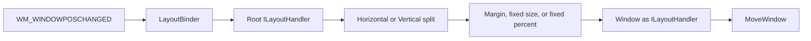

# Layout Engine Evaluation

This document is a maintainer-focused architecture assessment and improvement
plan. For application guidance, see [Using the Layout Engine](layout.md).

## Executive summary

Thirtytwo's layout engine is a small, immediate-mode composition system for
positioning Win32 child windows. A layout pass starts with a client rectangle
and a scale factor, recursively transforms or partitions that rectangle, and
ends by moving one or more `Window` instances.

The design is a strong fit for the repository's current needs: it is easy to
compose, deterministic, inexpensive to execute, DPI-aware where fixed logical
dimensions are involved, and well covered by tests and samples. The engine
should be evolved rather than replaced.

The highest-priority lifecycle and input-contract work has been implemented.
`LayoutBinder` performs an initial pass, skips unchanged notifications,
validates its inputs, and detaches safely when disposed. The engine now defines
physical-pixel coordinates and logical-to-physical scale centrally, rejects
invalid configuration consistently, and detects integer geometry overflow.
The most important remaining improvements are native-positioning and API-shape
work, not new layout algorithms:

1. Avoid redundant `MoveWindow` calls by comparing equivalent coordinate
   spaces.
2. Clarify naming and stateful behavior before the public API stabilizes.

Grid, flow, intrinsic measurement, and batched native positioning are useful
future directions, but they should follow evidence from real application needs
or profiling.

## Scope and evidence

This evaluation covers:

- the public contract and built-in handlers under
  [`src/thirtytwo/Layout`](../src/thirtytwo/Layout/);
- window integration in [`Window`](../src/thirtytwo/Window.cs) and
  [`WindowExtensions`](../src/thirtytwo/WindowExtensions.cs);
- the 66 dedicated tests in
  [`src/thirtytwo_tests/Layout`](../src/thirtytwo_tests/Layout/); and
- nine sample windows that bind layout handlers under
  [`src/samples`](../src/samples/).

No performance benchmark was run for this evaluation. Performance observations
below are based on source inspection and should be measured before they drive an
optimization.

## Architecture

The engine uses a push-based, single-pass model. `ILayoutHandler.Layout`
receives the available rectangle and scale, then either forwards a transformed
rectangle to one child or partitions it among several children.

### Main responsibilities

- [`ILayoutHandler`](../src/thirtytwo/Layout/ILayoutHandler.cs) defines the
  complete `Layout(Rectangle bounds, float scale)` contract.
- [`Layout`](../src/thirtytwo/Layout/Layout.cs) provides factories for the
  built-in composition nodes.
- [`HorizontalLayout`](../src/thirtytwo/Layout/HorizontalLayout.cs) creates
  horizontal bands by splitting height.
- [`VerticalLayout`](../src/thirtytwo/Layout/VerticalLayout.cs) creates vertical
  columns by splitting width.
- [`FixedSizeLayout`](../src/thirtytwo/Layout/FixedSizeLayout.cs) and
  [`FixedPercentLayout`](../src/thirtytwo/Layout/FixedPercentLayout.cs) size and
  align one child.
- [`PaddedLayout`](../src/thirtytwo/Layout/PaddedLayout.cs) applies scaled
  integer margins before forwarding the remaining bounds.
- [`ReplaceableLayout`](../src/thirtytwo/Layout/ReplaceableLayout.cs) retains
  the last pass and synchronously replays it when its child is replaced.
- [`FillLayout`](../src/thirtytwo/Layout/FillLayout.cs) and
  [`EmptyLayout`](../src/thirtytwo/Layout/EmptyLayout.cs) supply explicit
  pass-through and no-op composition nodes.
- [`LayoutBinder`](../src/thirtytwo/Layout/LayoutBinder.cs) performs the initial
  pass, starts changed-geometry passes from `WM_WINDOWPOSCHANGED`, and owns the
  detachable event registration.
- [`Window`](../src/thirtytwo/Window.cs) acts as the leaf handler and applies
  requested bounds with `MoveWindow`.

## Strengths

### 1. Small, composable abstraction

The one-method `ILayoutHandler` contract keeps the mental model compact. Split
nodes, transforming nodes, and window leaves all participate through the same
interface, so complex layouts are ordinary object composition rather than a
second control hierarchy.

The factory API keeps common layouts readable. The dedicated layout sample
combines proportional splits, margins, fixed percentages, and a replaceable
child without custom layout code in
[`Program.LayoutWindow.cs`](../src/samples/Layout/Program.LayoutWindow.cs).

### 2. Deterministic integer geometry

The split layouts deliberately truncate intermediate dimensions and assign the
remaining pixels to the last child. This guarantees that children cover the
entire input extent without a final gap caused by percentage rounding. Dedicated
tests pin this behavior for three-child horizontal and vertical splits.

Alignment also includes the input rectangle's nonzero origin, which is important
when composing layouts inside an already partitioned parent.

### 3. DPI-aware fixed dimensions

The scale factor is propagated through every built-in node. Fixed-size and
margin nodes apply it to logical dimensions, while proportional splits preserve
physical proportions and forward the scale for descendants. Tests cover common
fractional and integer scales, including 1.25, 1.5, 1.75, 2.0, and 5.0.

### 4. Low per-pass overhead

Built-in layout passes manipulate value-type rectangles and invoke child
handlers directly. Handler arrays are copied once during split-layout
construction, and the built-in nodes do not visibly allocate managed objects
during a pass. The result is a predictable $O(n)$ traversal of the composed
tree, where $n$ is the number of visited handlers.

This is a source-level observation, not a measured performance claim.

### 5. Good defensive behavior in proportional layouts

`LayoutValidation` rejects null arrays, null handlers, nonfinite percentages,
individual percentages outside $[0, 1]$, and totals outside a small tolerance
around 1.0. Split layouts also copy their input definitions, preventing later
caller mutation from changing an established layout tree.

### 6. Broad behavioral test coverage

The 66 dedicated tests cover:

- all fixed-size and fixed-percentage alignment combinations;
- nonzero parent origins and scale propagation;
- percentage validation and copied handler definitions;
- deterministic rounding remainder assignment;
- asymmetric, oversized, and extremely constrained margins;
- replacement before and after an initial pass;
- null handlers, invalid alignment and percentage values, and invalid scale;
- maximum integer dimensions and checked overflow behavior;
- padding value conversions; and
- integration with a real window-position notification.

This is unusually strong coverage for an engine of this size.

### 7. Managed binding lifecycle

`LayoutBinder` validates its window and handler, performs an initial pass, and
unsubscribes idempotently through `DisposableBase`. If the initial child layout
throws, construction rolls back the event subscription. Successful bounds and
scale are cached so equivalent notifications do not traverse the tree again.

Focused tests cover initial layout, changed and unchanged notifications,
double disposal, null arguments, and constructor rollback.

### 8. Explicit geometry and validation contracts

`ILayoutHandler` now defines bounds as physical pixels in the current layout
coordinate space and scale as physical pixels per logical unit. The standard
window binding validates scale once at the root, while fixed-size and margin
nodes also protect direct use because they consume scale themselves.

All built-in child-taking nodes reject null handlers. Fixed layouts reject
undefined alignments, negative fixed dimensions, and negative or nonfinite
percentages. Percentages above 100% and negative margins remain supported for
deliberate overflow and expansion. Checked conversion prevents unrepresentable
integer geometry from silently wrapping.

### 9. Demonstrated adoption

Nine sample windows use `AddLayoutHandler`, including native controls, ActiveX,
dark-mode controls, and WinUI-hosted content. They use concise one-line binding
for layouts that share the window lifetime and now receive an immediate initial
layout without additional sample-side lifecycle code. The engine is therefore
exercised across more than its dedicated layout sample.

## Weaknesses and risks

### 1. The window leaf compares different coordinate spaces

`Window.LayoutWindow` compares requested parent-relative bounds with
`GetClientRectangle()`. A Win32 client rectangle starts at `(0, 0)` and contains
only the client size, while a layout rectangle normally includes the child
position in its parent's client coordinates.

For a child positioned away from `(0, 0)`, the comparison cannot prove that the
window is already in the requested position, so repeated layout passes issue a
redundant `MoveWindow`. This is primarily a performance and repaint concern, not
a geometry correctness problem.

### 2. Split-layout naming is easy to misread

`HorizontalLayout` creates horizontal bands by splitting height, while
`VerticalLayout` creates vertical columns by splitting width. That interpretation
is internally consistent, but it is opposite the common convention where a
"horizontal layout" places children from left to right.

The source documentation resolves the ambiguity after a reader opens the type;
the factory call alone does not.

### 3. `ReplaceableLayout` has surprising pre-layout behavior

Assigning `Handler` synchronously calls the new handler. Before the first real
layout pass, it receives `Rectangle.Empty` and scale `1.0`. The behavior is
documented and tested, but a window leaf can consequently be moved to empty
bounds if replacement occurs too early.

The setter also combines state mutation with an immediate external callback,
which makes exception and reentrancy behavior harder to reason about.

### 4. Tight-space margin behavior is heuristic

When requested margins do not fit, `PaddedLayout` repeatedly halves already
rounded edge values until they fit. This terminates quickly and tests cover very
large values, but it encodes a specific policy:

- margins shrink in powers of two rather than to the largest exact fit;
- repeated rounding can favor one edge; and
- no minimum content size or minimum margin is part of the contract.

The behavior is robust, but it is not obvious to callers and may not match every
UI's desired compression policy.

### 5. `PaddingF` is disconnected from layout

`PaddingF` is public and tested, but no built-in layout node consumes it. The
engine accepts integer `Padding` and applies the scale later. This leaves an API
surface that suggests fractional-margin support without an integration path.

### 6. The engine has an intentional feature ceiling

There is no measure/arrange distinction, intrinsic or preferred size, minimum
and maximum constraints, visibility-aware allocation, wrapping, grid, or flow
layout. Every pass starts with a final rectangle and immediately causes effects
at the leaves.

That simplicity is a strength for small Win32 applications. It becomes a
limitation when layout depends on text measurement, control content, or
cross-child constraints.

### 7. Native moves are not batched

Each window leaf calls `MoveWindow` independently with repaint enabled. Large
trees may therefore produce repeated native calls and intermediate repainting.
There are no benchmarks showing this is currently a problem, but the architecture
does not provide a transaction boundary where sibling moves could use
`BeginDeferWindowPos` and `DeferWindowPos`.

## Recommended next steps

### Priority 1: Eliminate redundant native positioning

Compare requested bounds with the current window bounds expressed in the same
parent-client coordinate space, or retain the last successfully applied layout
rectangle in the window leaf. Add an integration test that verifies an unchanged
layout does not issue another native move.

Measure layout during interactive resizing before and after this change. If
native positioning or repainting is material, introduce an optional deferred
positioning transaction rather than adding caching throughout every node.

### Priority 2: Clarify composition APIs

Before API stabilization:

- consider `Rows` and `Columns` factory names, either as replacements or clear
  aliases for `Horizontal` and `Vertical`;
- track whether a real pass has occurred and avoid replaying empty default bounds
  unless that behavior is required; and
- either add a `PaddingF` layout path with defined rounding or remove the unused
  public type.

### Priority 3: Make margin compression a named policy

Replace the recursive half-scale fallback with an explicit policy or closed-form
calculation. Useful policies could include:

- preserve requested margins and allow zero content;
- scale margins proportionally to fit;
- preserve a configured minimum content extent; or
- clamp each edge independently.

Whichever policy is selected should be documented and tested for asymmetric,
negative, extreme, and zero-sized inputs.

### Priority 4: Add features only from demonstrated demand

If samples or applications need richer composition, add narrowly scoped nodes
such as an even grid or minimum/maximum constraint wrapper. A general retained
measure/arrange framework would substantially increase state, invalidation,
and debugging complexity and is not justified by current usage evidence.

## Suggested validation additions

The existing suite is strong. The highest-value additions are tests for:

- unchanged window-leaf bounds avoiding redundant moves;
- negative margins and the selected tight-space policy;
- revised replacement behavior before the first real pass, updating the
  existing default-replay test if that contract changes; and
- `PaddingF` behavior if it remains public and becomes integrated.

Performance work should begin with measurements for a representative nested
sample during live resizing, plus a synthetic tree with many sibling windows.

## Overall assessment

The layout engine is well matched to thirtytwo's present scope. Its composition
model is easier to understand than a general-purpose constraint or
measure/arrange system, its geometry is deterministic, and its tests and samples
show meaningful maturity.

The next iteration should preserve that simplicity. With binder lifecycle and
input contracts corrected, remove redundant native work before adding new layout
primitives. Those changes would make the current design more predictable and
extensible without turning it into a different kind of UI framework.