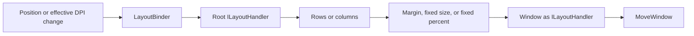

# Layout Engine Evaluation

This document is a maintainer-focused architecture assessment and improvement
plan. For application guidance, see [Using the Layout Engine](layout.md).

## Executive summary

Thirtytwo's layout engine is a small, immediate-mode composition system for
positioning Win32 child windows. A layout pass starts with a client rectangle
and a scale factor, recursively transforms or partitions that rectangle, and
ends by moving one or more `Window` instances.

The design is a strong fit for the repository's current needs: it is easy to
compose, deterministic, inexpensive to execute, DPI-aware where fixed logical
dimensions are involved, and well covered by tests and samples. The engine
should be evolved rather than replaced.

The highest-priority lifecycle, input-contract, native-positioning, and API-shape
work has been implemented. `LayoutBinder` performs an initial pass, skips
unchanged notifications, responds after effective DPI changes, validates its
inputs, and detaches safely when disposed. The engine defines physical-pixel
coordinates and logical-to-physical scale centrally, rejects invalid
configuration consistently, and detects integer geometry overflow. Window
leaves avoid redundant native moves, split APIs use explicit row and column
names, and replacement before an initial pass no longer forwards synthetic
empty bounds.

The recursive tight-space margin policy is now part of the documented contract.
The most important remaining work is measurement and demonstrated feature
demand, not another round of API correction.

Grid, flow, intrinsic measurement, and batched native positioning are useful
future directions, but they should follow evidence from real application needs
or profiling.

## Scope and evidence

This evaluation covers:

- the public contract and built-in handlers under
  [`src/thirtytwo/Layout`](../src/thirtytwo/Layout/);
- window integration in [`Window`](../src/thirtytwo/Window.cs) and
  [`WindowExtensions`](../src/thirtytwo/WindowExtensions.cs);
- the 74 dedicated tests in
  [`src/thirtytwo_tests/Layout`](../src/thirtytwo_tests/Layout/); and
- nine sample windows that bind layout handlers under
  [`src/samples`](../src/samples/).

No performance benchmark was run for this evaluation. Performance observations
below are based on source inspection and should be measured before they drive an
optimization.

## Architecture

The engine uses a push-based, single-pass model. `ILayoutHandler.Layout`
receives the available rectangle and scale, then either forwards a transformed
rectangle to one child or partitions it among several children.

### Main responsibilities

- [`ILayoutHandler`](../src/thirtytwo/Layout/ILayoutHandler.cs) defines the
  complete `Layout(Rectangle bounds, float scale)` contract.
- [`Layout`](../src/thirtytwo/Layout/Layout.cs) provides factories for the
  built-in composition nodes.
- [`RowsLayout`](../src/thirtytwo/Layout/RowsLayout.cs) creates rows by splitting
  height.
- [`ColumnsLayout`](../src/thirtytwo/Layout/ColumnsLayout.cs) creates columns by
  splitting width.
- [`FixedSizeLayout`](../src/thirtytwo/Layout/FixedSizeLayout.cs) and
  [`FixedPercentLayout`](../src/thirtytwo/Layout/FixedPercentLayout.cs) size and
  align one child.
- [`PaddedLayout`](../src/thirtytwo/Layout/PaddedLayout.cs) applies scaled
  integer margins before forwarding the remaining bounds.
- [`ReplaceableLayout`](../src/thirtytwo/Layout/ReplaceableLayout.cs) retains
  the last pass and synchronously replays it when its child is replaced after
  that first pass.
- [`FillLayout`](../src/thirtytwo/Layout/FillLayout.cs) and
  [`EmptyLayout`](../src/thirtytwo/Layout/EmptyLayout.cs) supply explicit
  pass-through and no-op composition nodes.
- [`LayoutBinder`](../src/thirtytwo/Layout/LayoutBinder.cs) performs the initial
  pass, starts passes after changed geometry or effective DPI, and owns the
  detachable event registration.
- [`Window`](../src/thirtytwo/Window.cs) acts as the leaf handler, compares
  requested and current outer bounds in the same coordinate space, and applies
  changes with `MoveWindow`.

## Strengths

### 1. Small, composable abstraction

The one-method `ILayoutHandler` contract keeps the mental model compact. Split
nodes, transforming nodes, and window leaves all participate through the same
interface, so complex layouts are ordinary object composition rather than a
second control hierarchy.

The factory API keeps common layouts readable. The dedicated layout sample
combines proportional splits, margins, fixed percentages, and a replaceable
child without custom layout code in
[`Program.LayoutWindow.cs`](../src/samples/Layout/Program.LayoutWindow.cs).

### 2. Deterministic integer geometry

The split layouts deliberately truncate intermediate dimensions and assign the
remaining pixels to the last child. This guarantees that children cover the
entire input extent without a final gap caused by percentage rounding. Dedicated
tests pin this behavior for three-row and three-column splits.

Alignment also includes the input rectangle's nonzero origin, which is important
when composing layouts inside an already partitioned parent.

### 3. DPI-aware fixed dimensions

The scale factor is propagated through every built-in node. Fixed-size and
margin nodes apply it to logical dimensions, while proportional splits preserve
physical proportions and forward the scale for descendants. Tests cover common
fractional and integer scales, including 1.25, 1.5, 1.75, 2.0, and 5.0.

### 4. Low per-pass overhead

Built-in layout passes manipulate value-type rectangles and invoke child
handlers directly. Handler arrays are copied once during split-layout
construction, and the built-in nodes do not visibly allocate managed objects
during a pass. The result is a predictable $O(n)$ traversal of the composed
tree, where $n$ is the number of visited handlers.

This is a source-level observation, not a measured performance claim.

### 5. Good defensive behavior in proportional layouts

`LayoutValidation` rejects null arrays, null handlers, nonfinite percentages,
individual percentages outside $[0, 1]$, and totals outside a small tolerance
around 1.0. Split layouts also copy their input definitions, preventing later
caller mutation from changing an established layout tree.

### 6. Broad behavioral test coverage

The 74 dedicated tests cover:

- all fixed-size and fixed-percentage alignment combinations;
- nonzero parent origins and scale propagation;
- percentage validation and copied handler definitions;
- deterministic rounding remainder assignment;
- asymmetric, oversized, and extremely constrained margins;
- replacement before and after an initial pass;
- null handlers, invalid alignment and percentage values, and invalid scale;
- maximum integer dimensions and checked overflow behavior;
- padding value conversions;
- native child, top-level, and owned-window positioning; and
- position and effective-DPI binding notifications.

This is unusually strong coverage for an engine of this size.

### 7. Managed binding lifecycle

`LayoutBinder` validates its window and handler, performs an initial pass, and
unsubscribes idempotently through `DisposableBase`. If the initial child layout
throws, construction rolls back its window-message subscription. Successful
bounds and scale are cached so equivalent notifications do not traverse the
tree again. Child DPI-driven passes sample the current effective DPI directly
from the window while handling `WM_DPICHANGED_AFTERPARENT`.

Focused tests cover initial layout, changed and unchanged position and DPI
notifications, double disposal, null arguments, and constructor rollback.

### 8. Explicit geometry and validation contracts

`ILayoutHandler` now defines bounds as physical pixels in the current layout
coordinate space and scale as physical pixels per logical unit. The standard
window binding validates scale once at the root, while fixed-size and margin
nodes also protect direct use because they consume scale themselves.

All built-in child-taking nodes reject null handlers. Fixed layouts reject
undefined alignments, negative fixed dimensions, and negative or nonfinite
percentages. Percentages above 100% and negative margins remain supported for
deliberate overflow and expansion. Checked conversion prevents unrepresentable
integer geometry from silently wrapping.

### 9. Coordinate-correct native positioning

Window leaves compare requested outer bounds against the current outer window
rectangle instead of its `(0, 0)`-based client rectangle. Child rectangles are
converted from screen coordinates to the parent's client coordinates before
comparison. Top-level and owned pop-up windows remain in screen coordinates.

Equivalent layout passes therefore avoid redundant `MoveWindow` calls, while
changed bounds still move and resize the window. Integration tests cover
bordered children at nonzero origins, top-level windows, and owned pop-ups.

### 10. Explicit composition and replacement APIs

`Layout.Rows` and `Layout.Columns` state the direction of proportional
composition directly. Their concrete `RowsLayout` and `ColumnsLayout` types use
the same terminology, so factory calls and direct construction are consistent.

`ReplaceableLayout` distinguishes selection from replay. Replacing its child
before the first pass does not invoke it with synthetic defaults; the selected
child receives the first real bounds normally. Replacements after that pass are
still laid out synchronously with the most recent bounds and scale.

### 11. Documented tight-space margins

`PaddedLayout` resolves each axis independently. It first applies DPI scaling
and integer rounding. If the two margins exceed the available extent, it
repeatedly halves those rounded values and rounds again until they fit. This
selects a power-of-two reduction rather than the largest exact fit.

Halving stops when both margins on an axis are one pixel or less. If that pair
still does not fit, or if the input extent is nonpositive, that axis is
forwarded unchanged. Negative margins remain supported and expand bounds when
their combined value fits.

### 12. Demonstrated adoption

Nine sample windows use `AddLayoutHandler`, including native controls, ActiveX,
dark-mode controls, and WinUI-hosted content. They use concise one-line binding
for layouts that share the window lifetime and now receive an immediate initial
layout without additional sample-side lifecycle code. The engine is therefore
exercised across more than its dedicated layout sample.

## Weaknesses and risks

### 1. Tight-space margin behavior is coarse

When requested margins do not fit, `PaddedLayout` repeatedly halves already
rounded edge values until they fit. This terminates quickly and tests cover very
large values, but it encodes a specific policy:

- margins shrink in powers of two rather than to the largest exact fit;
- repeated rounding can favor one edge; and
- no minimum content size or minimum margin is part of the contract.

The behavior is robust, documented, and deterministic, but may not match every
UI's desired compression policy.

### 2. `PaddingF` is disconnected from layout

`PaddingF` is public and tested, but no built-in layout node consumes it. The
engine accepts integer `Padding` and applies the scale later. This leaves an API
surface that suggests fractional-margin support without an integration path.

### 3. The engine has an intentional feature ceiling

There is no measure/arrange distinction, intrinsic or preferred size, minimum
and maximum constraints, visibility-aware allocation, wrapping, grid, or flow
layout. Every pass starts with a final rectangle and immediately causes effects
at the leaves.

That simplicity is a strength for small Win32 applications. It becomes a
limitation when layout depends on text measurement, control content, or
cross-child constraints.

### 4. Native moves are not batched

Each window leaf calls `MoveWindow` independently with repaint enabled. Large
trees may therefore produce repeated native calls and intermediate repainting.
There are no benchmarks showing this is currently a problem, but the architecture
does not provide a transaction boundary where sibling moves could use
`BeginDeferWindowPos` and `DeferWindowPos`.

## Recommended next steps

### Priority 1: Measure before batching native moves

Measure layout during interactive resizing and with a representative synthetic
tree. The engine now suppresses unchanged native positioning, so measurements
can show whether the remaining `MoveWindow` calls and repainting justify an
optional `BeginDeferWindowPos` and `DeferWindowPos` transaction.

### Priority 2: Integrate fractional margins when needed

Retain `PaddingF` as the representation for fractional logical margins. Add a
built-in layout path only when an application needs sub-unit margins, and define
its rounding and tight-space behavior against the integer-margin contract.

### Priority 3: Add features only from demonstrated demand

If samples or applications need richer composition, add narrowly scoped nodes
such as an even grid or minimum/maximum constraint wrapper. A general retained
measure/arrange framework would substantially increase state, invalidation,
and debugging complexity and is not justified by current usage evidence.

## Suggested validation additions

The existing suite is strong. The highest-value additions are tests for:

- a real mixed-DPI transition confirming nested binders use the new effective
  scale;
- `PaddingF` behavior when it becomes integrated; and
- performance measurements before introducing deferred native positioning.

Performance work should begin with measurements for a representative nested
sample during live resizing, plus a synthetic tree with many sibling windows.

## Overall assessment

The layout engine is well matched to thirtytwo's present scope. Its composition
model is easier to understand than a general-purpose constraint or
measure/arrange system, its geometry is deterministic, and its tests and samples
show meaningful maturity.

The next iteration should preserve that simplicity. Binder lifecycle, input
contracts, coordinate-correct native positioning, composition naming,
replacement timing, and tight-space margin behavior are now explicit. Measure
the remaining native work before introducing deferred positioning, and add
layout primitives only for demonstrated application needs.