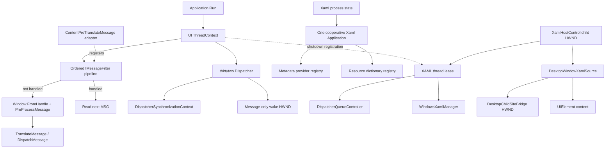

# WinUI 3 HWND Hosting Plan

## Goal

Build and validate a production-shaped WinUI 3 hosting layer in an optional
`thirtytwo.winui` library that provides executable evidence for a similar
WinForms design. The work must answer lifecycle, message processing, focus,
layout, DPI, accessibility, deployment, multi-library composition, performance,
and designer questions without adding a Windows App SDK dependency to the core
`thirtytwo` library or its consumers.

This is an investigation plan, not a commitment to a public API. Public surface
should remain experimental until the corresponding acceptance gates pass.

## Current Status

As of August 7, 2026:

- Milestone 0, the raw WinUI hosting oracle, is merged on `main` through
  [PR #25](https://github.com/JeremyKuhne/thirtytwo/pull/25) (`96babc6`).
- Milestone 1 is merged on `main` through
  [PR #26](https://github.com/JeremyKuhne/thirtytwo/pull/26) (`389e145`). It
  adds the dependency-free core dispatcher, thread context, message filters,
  delayed work, timers, diagnostics, and focused tests.
- The merged PR's final check passes. Milestone 2 is implemented in the current
  work: the raw oracle now runs named out-of-process scenarios under a bounded
  test-side controller with structured artifacts, UIA and screenshot capture,
  and process-tree cleanup.
- The full local Release suite passes 354 tests with one manual test skipped.
  No `thirtytwo.winui` library exists yet; milestone 3, the optional host
  environment, is next.

## Evidence Baseline

### Historical prototype

The archival [`origin/winui`](https://github.com/JeremyKuhne/thirtytwo/tree/winui)
branch contains three commits based on a 2024 repository state:

1. `339bf8c` hosted a `ColorPicker` through the Layout sample.
2. `1dd6bd8` added a raw Win32 `ControlHost` oracle.
3. `a29951e` recorded the island child HWND and added paint handling.

The prototype established that creating a dispatcher and assigning a control
was not enough. A usable host also needed a WinUI `Application`, an
`IXamlMetadataProvider`, `XamlControlsXamlMetaDataProvider`,
`WindowsXamlManager`, and `XamlControlsResources`.

The historical branch should remain unchanged as evidence. Milestone 0
transplanted the raw oracle onto the then-current `main` rather than rebasing
stale project and solution infrastructure; that work is now merged through
PR #25.

### WinUI oracle baseline

The resurrected sample is under `src/samples/WinUI/ControlHost` and deliberately
does not add a Windows App SDK dependency to the core `thirtytwo` assembly. It
uses:

- .NET 10 and x64;
- stable `Microsoft.WindowsAppSDK` 2.3.1;
- unpackaged runtime bootstrap through `WindowsPackageType=None`;
- `DispatcherQueueController.CreateOnCurrentThread()`;
- a WinUI `Application` that composes metadata providers and control resources;
- `DesktopWindowXamlSource` initialized against a raw parent HWND;
- `ContentPreTranslateMessage` before normal USER32 translation/dispatch;
- `ColorPicker` inside a `Grid` root;
- `DesktopSiteBridge.MoveAndResize` for physical-pixel bounds;
- deterministic content/source disposal before dispatcher shutdown.

Validated locally on Windows x64 (OS build 26200, .NET SDK 10.0.302 selected
by the repository, Windows App Runtime 2.3.1 installed):

```pwsh
dotnet build src/samples/WinUI/ControlHost/ControlHost.csproj --configuration Release
dotnet run --project src/samples/WinUI/ControlHost/ControlHost.csproj --configuration Release --no-build
```

The process created a responsive top-level HWND titled
`ThirtyTwo WinUI 3 Control Host`. Its child tree contained
`Microsoft.UI.Content.DesktopChildSiteBridge`, `InputSiteWindowClass`, and
`InputNonClientPointerSource`. UI Automation exposed 12 descendants, including
the `ColorPicker`, brightness slider, color-model combo box, RGB edit fields,
and labels. The process then exited normally through `WM_CLOSE`. Pixel-level
rendering, manual mouse/keyboard interaction, focus return, screen-reader
behavior, ARM64, and deployment beyond this machine remain unverified.

## External Behavioral Oracles

Use public sources only:

- [Windows App SDK Islands samples](https://github.com/microsoft/WindowsAppSDK-Samples/tree/main/Samples/Islands)
- [C# unpackaged WinForms Islands sample](https://github.com/microsoft/WindowsAppSDK-Samples/tree/main/Samples/Islands/cs-winforms-unpackaged)
- [DesktopWindowXamlSource](https://learn.microsoft.com/windows/windows-app-sdk/api/winrt/microsoft.ui.xaml.hosting.desktopwindowxamlsource)
- [WindowsXamlManager.InitializeForCurrentThread](https://learn.microsoft.com/windows/windows-app-sdk/api/winrt/microsoft.ui.xaml.hosting.windowsxamlmanager.initializeforcurrentthread)
- [DispatcherQueueController.CreateOnCurrentThread](https://learn.microsoft.com/windows/windows-app-sdk/api/winrt/microsoft.ui.dispatching.dispatcherqueuecontroller.createoncurrentthread)
- [Windows App SDK unpackaged deployment](https://learn.microsoft.com/windows/apps/windows-app-sdk/deploy-unpackaged-apps)

For each behavior, retain both:

1. a raw HWND oracle that isolates Windows App SDK behavior; and
2. a `thirtytwo` host that proves the framework abstraction preserves it.

The current official WinForms sample adds two requirements absent from the
original prototype:

- every message must pass through `ContentPreTranslateMessage`; and
- custom WinUI libraries must register their metadata provider with the shared
  XAML application.

## Proposed Repository Shape

Keep the optional dependency isolated:

```text
src/
  thirtytwo/
    Threading/
      Dispatcher.cs
      DispatcherSynchronizationContext.cs
      DispatcherWorkItem.cs
    Messaging/
      IMessageFilter.cs
      MessageFilterRegistration.cs
  thirtytwo.winui/
    thirtytwo.winui.csproj
    XamlHostEnvironment.cs
    XamlHostEnvironment.ThreadState.cs
    XamlMetadataProviderRegistry.cs
    XamlHostControl.cs
    XamlHostControl.Focus.cs
    XamlHostControl.Layout.cs
    WinUIColorPicker.cs
  samples/WinUI/
    ControlHost/                  # raw oracle
    ThirtyTwoHost/                # framework integration and test pages
    SampleWinUIClassLibrary/      # metadata/resource composition
  thirtytwo_tests/
    Threading/
    Messaging/
  thirtytwo.winui_tests/
    Unit/
    IntegrationHost/             # out-of-process STA executable
docs/
  winui-hosting-plan.md
  winui-hosting-results.md
```

The `src/thirtytwo/Threading`, `src/thirtytwo/Messaging`, and corresponding
core test entries now exist on `main`. The integration harness is under
`src/thirtytwo_tests/WinUI/IntegrationHarness` and drives the raw
`ControlHost` oracle. The `thirtytwo.winui`, WinUI framework-host sample,
WinUI class-library sample, and dedicated WinUI test projects remain proposed.

Do not reference `Microsoft.WindowsAppSDK` from `src/thirtytwo/thirtytwo.csproj`.
The core library should gain only generally useful Win32 UI-thread and HWND
lifecycle primitives. The optional `thirtytwo.winui` assembly owns all WinUI
types and the Windows App SDK package dependency.

The dispatcher architecture, framework comparison, Task-based contract, and
rollout gates are defined in the dedicated
[UI dispatcher implementation plan](ui-dispatcher-plan.md). That plan controls
dispatcher details when this hosting roadmap only summarizes them.

### Assembly and package dependency contract

The dependency graph is one-way:

```text
WinUI application -> thirtytwo.winui -> thirtytwo
                            |
                            +---------> Microsoft.WindowsAppSDK

non-WinUI application ----------------> thirtytwo
```

- `thirtytwo` must neither reference `thirtytwo.winui` nor carry a direct or
  transitive `Microsoft.WindowsAppSDK` package dependency.
- Applications opt into the Windows App SDK dependency only by referencing
  `thirtytwo.winui`. The eventual `thirtytwo.winui` NuGet package declares both
  `thirtytwo` and `Microsoft.WindowsAppSDK` as dependencies.
- `thirtytwo.winui` owns integration and bootstrap diagnostics, but executable
  projects own deployment policy. The library must not force
  `WindowsPackageType`, `WindowsAppSDKSelfContained`, `SelfContained`, or a
  `RuntimeIdentifier` on consumers.
- Framework-dependent applications must deploy the matching Windows App Runtime
  and .NET runtime prerequisites. Self-contained applications must explicitly
  opt into both Windows App SDK and .NET self-contained deployment; enabling one
  does not imply the other.
- Package tests must restore isolated core-only and WinUI consumers. The
  core-only dependency graph must contain no `Microsoft.WindowsAppSDK`; the
  WinUI graph must contain the pinned supported version.

## Target Architecture




### Ownership rules

- Process state owns one cooperative XAML application and provider/resource
  registries. The application is retained for process lifetime; the prototype
  must not dispose and recreate it when the last host closes.
- The first implementation supports one designated XAML UI thread. A second
  XAML UI thread is an experiment, not a promised capability.
- The optional WinUI layer checks for an existing dispatcher queue. It borrows
  an existing queue or creates and owns one when absent; only an owned queue is
  shut down by the layer. The application that supplied a borrowed queue remains
  responsible for its lifetime; core shutdown only unregisters WinUI integration
  from that queue and does not claim to stop it.
- The core `thirtytwo` dispatcher never references or creates Windows App SDK
  types.
- A thread state remains alive until its last host is disposed.
- Each host owns one `DesktopWindowXamlSource` and its event subscriptions.
- Hosted content is created and released on the host thread.
- After core dispatcher admission closes, component shutdown order is
  content/events, source, XAML-manager lease, and an owned dispatcher queue;
  core dispatcher resources are released last.
- Wrong-thread calls fail with the expected and actual thread IDs before calling
  WinUI.

### Message-loop contract

Milestone 1 implements this experimental core shape:

```csharp
public interface IMessageFilter
{
    bool PreFilterMessage(ref MSG message);
}

public readonly struct MessageFilterRegistration : IDisposable
{
    // Removes one filter from the UI thread that registered it.
}
```

Registration is per UI thread, preserves registration order, returns a
disposable registration, and rejects mutation from another thread. The loop
uses a stable snapshot so a filter may dispose itself without corrupting the
current traversal. Exceptions escape `Application.Run` through its existing
cleanup path.

`Application.Run` invokes the filter chain before managed-window lookup:

```csharp
if (threadContext.PreFilterMessage(ref message))
{
    continue;
}

if (Window.FromHandle(message.hwnd) is { } target
    && target.PreProcessMessage(ref message))
{
    continue;
}

PInvoke.TranslateMessage(message);
PInvoke.DispatchMessage(message);
```

This ordering is required because the XAML input HWND is not represented by a
`thirtytwo` `Window`. With no registered filters, existing loop behavior is
unchanged.

### Dispatcher and Windows App SDK queue coordination

- The core dispatcher follows the Task-based contract in the
  [UI dispatcher implementation plan](ui-dispatcher-plan.md); queue work-item
  state remains internal rather than exposing a WPF-style operation object.
- `Dispatcher.FromHandle(...)` lets integration code discover the active core dispatcher from either a host HWND or a
  WinUI-owned child HWND without requiring that HWND to map to a managed `Window`; `Window.Dispatcher` retains the
  managed window's stable dispatcher affinity across shutdown and handle destruction.
- The core `Dispatcher` owns its message-only wake HWND; the `ThreadContext`
  owns that dispatcher for the outer message-loop lifetime.
- The WinUI environment is created only after that context is running. It
  registers `ContentPreTranslateMessage` as a message filter and its queue/XAML
  cleanup as a thread-context shutdown callback.
- An existing Windows App SDK dispatcher queue is borrowed; an absent queue is
  created by `DispatcherQueueController.CreateOnCurrentThread()` and marked as
  owned.
- Production shutdown does not force-exit on a timeout. Out-of-process tests
  enforce a configurable timeout, capture logs/dumps, and terminate the failed
  child process so the test run cannot hang.
- Core dispatcher admission closes first. Registered integration cleanup then
  runs on the UI thread in reverse registration order before the core wake HWND
  and other dispatcher-owned resources are released. An owned Windows App SDK
  queue must shut down in that cleanup phase.

### XAML application and composition contract

- If `Microsoft.UI.Xaml.Application.Current` is null, the WinUI layer creates
  its cooperative application on the designated XAML thread.
- If an application already exists, the layer never creates a second one. It
  detects whether that application exposes the required metadata/resource
  registration contract and reports which capabilities are unavailable when
  it does not.
- Re-registering the same provider or dictionary is idempotent.
- Provider lookup order is deterministic. The prototype must detect and trace
  cases where distinct providers claim the same XAML type; it must not leave
  collision behavior accidental.
- Resource dictionaries follow documented XAML merge order (later dictionaries
  override an earlier key), with explicit tests for duplicate keys and theme
  dictionaries.
- Secondary XAML UI threads, `AssemblyLoadContext` unload, and application
  replacement remain experiments until demonstrated.

## Current Functionality and Remaining Work

The merged core foundation closes the prerequisites for the integration
harness and host-environment milestones. Remaining work is owned by the later
WinUI, HWND-lifecycle, focus, deployment, or measurement milestones; it is not
an incomplete dispatcher deliverable.

### Completed critical core foundation

| Capability | Merged implementation | Validation | Later milestone boundary |
| --- | --- | --- | --- |
| UI dispatcher | PR #26 adds thread-bound `Dispatcher`, stable `Window.Dispatcher` affinity, active raw-HWND discovery, access checks, Task-returning synchronous and async `ValueTask` callbacks, cancellation, delayed work, timers, exception propagation, one-item FIFO turns, diagnostics, and deterministic shutdown | Focused discovery, ordering, cancellation, wake-failure, continuation, timer, modal-loop, and shutdown tests pass | The API remains experimental; WinUI coexistence is proved in milestones 3 and 5, while comparative fairness and performance evidence belongs to milestone 9 |
| Global message filters | Per-thread `Application.AddMessageFilter` provides ordered stable snapshots and disposable registrations before managed-window lookup | Core ordering, mutation, handled-message, exception, and wrong-thread tests pass | The `ContentPreTranslateMessage` adapter and its integration tests belong to milestone 5 |
| Message-loop context | Internal `ThreadContext` owns the outer pump, dispatcher, synchronization context, filters, quit/fault state, and reverse-order internal shutdown callbacks. Public `Dispatcher.ShutdownToken` and `Completion` expose shutdown start and completed resource release across assembly boundaries | Pump, quit ordering, repeated-run, shutdown-signal, and native COM file-dialog modal-loop scenarios pass | Milestone 3 must prove owned/borrowed Windows App SDK queue teardown using the public signals; add another core registration surface only if that evidence requires one |
| Thread affinity | Dispatcher and context retain managed/native thread identity and reject wrong-thread access | Access, discovery, registration, and disposal tests pass | STA verification and WinUI-specific expected/actual thread diagnostics belong to the milestone 3 optional layer |

### High-priority HWND gaps

| Capability | Current state | Required implementation | Validation |
| --- | --- | --- | --- |
| Reparenting | Parent supplied only during construction; no `SetParent` wrapper | Typed `SetParent` plus style/coordinate rules and lifecycle notification | Parent changes, nested containers, old parent destruction |
| Position/z-order | `MoveWindow` exists; no first-class `SetWindowPos`/z-order API | Bounds, z-order, show/hide, and no-activate operations | Overlap, clipping, adjacent islands, scrolling |
| State queries | No cohesive visible/enabled/minimized/parent query surface | Typed wrappers around USER32 state APIs | Focus and layout skip invalid targets |
| Owner relationships | Parent/child HWNDs are modeled, but top-level owned windows are not | Typed owner APIs distinct from child parenting | Popup/tool-window activation and z-order |
| Host HWND lifecycle | `Window` exposes messages and clears its handle on `WM_NCDESTROY`, but has no dedicated created/destroyed or recreation API | Milestone 4 first proves post-construction attachment and destruction through existing behavior; add dedicated hooks or recreation only where those experiments require them | Exactly-once initial attach, destroy notification, failed construction, recreation, reparenting, and parent destruction |
| Focus traversal | Raw `SetFocus` and per-window preprocessing exist, but there is no framework tab-order traversal service | Milestone 5 adds only the traversal contract required by native/XAML boundary behavior | Alternating native/XAML controls, wraparound, and disabled/hidden controls |
| Nested/modal pumping | Dispatcher work runs through supported native modal loops; `ThreadModalScope` disables windows but does not own a nested loop | Add a thread-context-owned nested-loop contract only when a production component requires one | The native COM file-dialog scenario passes; a modal dialog over an open XAML popup remains pending |
| DPI notifications | Per-monitor-v2 context and `WM_DPICHANGED` handling exist; child before/after-parent transitions are not modeled | Public DPI transition hooks and centralized logical-to-physical conversion contract | Mixed-DPI monitors, negative coordinates, fractional scaling |
| Message-loop interop | Public message-filter registration, `Dispatcher.ShutdownToken`, and `Dispatcher.Completion` expose preprocessing plus shutdown start/completion across assemblies; internal callbacks retain reverse-order framework teardown | Milestone 3 proves these signals are sufficient for WinUI filter removal and owned/borrowed queue cleanup; add a new core registration API only if the experiment demonstrates a missing ordering guarantee | WinUI filter removal and queue cleanup happen exactly once before core wake-resource release |
| System settings | Theme/settings messages exist as enums but there is no shared high-contrast or settings-change service | Per-thread/process notifications plus high-contrast query helpers | Runtime light/dark/high-contrast and text-scale changes |

### WinUI-layer gaps

| Capability | Required behavior |
| --- | --- |
| Optional assembly boundary | Put all WinUI types and the `Microsoft.WindowsAppSDK` package dependency in `thirtytwo.winui`; keep core package restore and runtime deployment free of Windows App SDK artifacts |
| Runtime bootstrap | Diagnose missing Windows App Runtime, architecture mismatch, bootstrap failure, and missing runtime WinMD/resources before XAML activation |
| XAML application ownership | Apply the process-lifetime application contract above; detect an existing compatible application; never silently create a second application |
| Metadata composition | Register providers from multiple wrapper assemblies with idempotence, deterministic ordering, and collision telemetry; test custom controls in two assemblies |
| Resource composition | Add built-in and library dictionaries once, define last-added key precedence, support theme dictionaries, and report missing-resource initialization clearly |
| Thread environment | Reference-counted environment for the designated XAML UI thread with STA and expected/actual thread diagnostics, explicit borrowed/owned dispatcher-queue and XAML-manager state, and teardown coordinated through the core dispatcher's public shutdown signals |
| Generic host | `XamlHostControl : CustomControl` owns the intermediate managed child HWND and participates in `Window.FromHandle`, layout, and preprocessing. WinUI alone owns the nested `DesktopChildSiteBridge` HWND |
| Typed wrappers | Project common .NET types and events; avoid leaking the entire WinRT object model by default |
| Diagnostics | Opt-in tracing for bootstrap, thread IDs, HWNDs, bounds, focus, resources, and disposal order |

### Validation infrastructure status

| Capability | Current state | Later milestone boundary |
| --- | --- | --- |
| Out-of-process STA integration runner | Implemented in the ordinary test project. The raw `ControlHost` is the STA child, one named scenario runs per process, and the controller records exit code, result JSON, lifecycle events, raw stdout/stderr, process/thread IDs, and the complete native child-HWND set | Milestone 3 adds optional-layer scenarios to the same protocol |
| Watchdog/timeouts | Implemented with a per-scenario timeout, process-tree termination scoped to the launched PID, bounded stream capture, PID-validated HWND use, optional dump discovery, and diagnostics naming the scenario, process/thread IDs, HWNDs, and last event | Add dump production only when CI or product investigations require it |
| UI Automation capture | Implemented as a bounded control-view walk. The raw ColorPicker scenario currently exposes 19 elements including sliders, a combo box, edit fields, and the HWND boundary panes | Milestones 5 and 7 add focus, patterns, fragment-parentage, and assistive-technology assertions |
| Screenshot/pixel capture | Implemented as a bounded screen capture with dimensions, sampled-color count, and retained PNG. The current oracle capture is 900x700 and nonblank | Milestones 6 and 7 add DPI, clipping, popup, and theme comparisons |
| Clean-machine deployment jobs | Not implemented; build success does not prove runtime packages, bootstrap, WinMD files, and resources deploy correctly | Milestone 8 |
| Performance project | Not implemented; compare one island per wrapper with a shared island at 1, 10, 50, and 100 controls | Milestone 9; vendor the `performance-testing` skill when this project exists |

## WinForms Design Transfer

Every milestone must maintain a parity table rather than assuming `thirtytwo`
behavior maps directly to WinForms.

| Concern | `thirtytwo` experiment | WinForms counterpart to evaluate |
| --- | --- | --- |
| Dispatcher | Implemented thread dispatcher and synchronization context | `Control.Invoke/BeginInvoke`, `WindowsFormsSynchronizationContext` |
| Message filter | Implemented `Application` per-thread filter chain | `Application.AddMessageFilter` |
| Handle lifecycle | `Window` create/destroy hooks | `OnHandleCreated`, `OnHandleDestroyed`, `RecreateHandle` |
| Layout | `ILayoutHandler.Layout` and physical HWND bounds | `SetBoundsCore`, docking, anchoring, scaling |
| Focus | Native traversal plus XAML navigation events | `SelectNextControl`, `ProcessTabKey`, dialog keys |
| Designer | Separate runtime host with explicit placeholder mode | Out-of-process WinForms designer and `DesignMode` |
| Accessibility | Host HWND plus child XAML UIA subtree | `AccessibleObject`, `WM_GETOBJECT`, fragment navigation |

If a solution depends on a `thirtytwo`-specific invariant unavailable in
WinForms, record that as a design divergence rather than hiding it in the host.
The `thirtytwo` dispatcher is not intended to copy the `Control.Invoke` API.
The experiment targets behavioral parity (thread affinity, ordering, exception
and shutdown semantics); a WinForms design should adapt those findings to
`Control.Invoke`, `BeginInvoke`, and `WindowsFormsSynchronizationContext`.

Full Visual Studio designer integration is outside this investigation. The
required designer result is a stable out-of-process placeholder, toolbox load,
basic property serialization, and reload behavior without starting leaked XAML
infrastructure. Live preview and custom designer tooling are follow-up work.

## Implementation Branches

Each branch starts from the previous merged milestone. Avoid one long-running
stack so validation evidence remains attributable.

### 0. `winui-hosting-prototype` - merged in PR #25

Deliverables:

- transplant the raw host from `origin/winui` onto current `main`;
- select stable Windows App SDK 2.3.1;
- add XAML application, metadata, resources, message preprocessing, and clean
  shutdown;
- record this implementation plan.

Exit gate:

- clean build;
- on the recorded Windows x64 development machine, a responsive host with the
  expected island child HWNDs and `ColorPicker` UIA subtree;
- close through `WM_DESTROY`, complete `DispatcherQueue.ShutdownQueue`, and exit
  with code 0;
- verify `WindowsPackageType=None`, PerMonitorV2 manifest configuration, and
  stable package/RID pins;
- explicitly defer native-sibling tab traversal and `TakeFocusRequested` to the
  focus milestone;
- historical branch remains unchanged.

The milestone is complete. Its local x64 runtime and UIA observations remain
the raw oracle baseline until milestone 2 captures them through the automated
harness.

### 1. `dispatcher-thread-context` - merged in PR #26

Core-only deliverables:

- `ThreadContext`, `Dispatcher`, internal dispatcher work items, and
  `DispatcherSynchronizationContext`;
- per-thread ordered `IMessageFilter` registrations;
- `Application.Run` integration and deterministic shutdown hooks;
- async `ValueTask` callbacks, cancellation, native modal-loop dispatch,
  delayed work, `DispatcherTimer`, and EventSource observability;
- no Windows App SDK dependency in core.

Exit gate:

- unit tests for ordering, thread checks, exceptions, cancellation, filter
  mutation, shutdown, and repeat runs;
- real USER32 wake, native file-dialog modal-loop, timer, fairness, and
  wake-failure scenarios;
- existing samples and tests unchanged behavior;
- no Windows App SDK dependency in core;
- Debug and Release builds plus both full test suites pass with 341 tests
  passed and one manual test skipped in each configuration.

The dependency-free core milestone is complete. Its public surface remains
experimental while product integration and performance evidence accumulate,
but those are later acceptance gates. The `ContentPreTranslateMessage` adapter
and Windows App SDK queue ownership checks remain deliverables of
`thirtytwo.winui`.

### 2. `winui-integration-harness` - implemented

Deliverables:

- named scenario mode in the raw out-of-process STA `ControlHost`, one scenario
  per process;
- test-side launcher that captures exit code, structured result JSON, lifecycle
  logs, raw stdout/stderr, process/thread IDs, native child HWNDs, and an
  optional dump location;
- configurable watchdog and process-tree cleanup;
- reusable bounded UIA and screenshot capture helpers;
- baseline scenarios for startup, UIA tree, normal close, and shutdown timeout.

Exit gate:

- failed scenarios cannot hang the ordinary test runner;
- timeout output names the scenario, process/thread IDs, HWNDs, and last log
  event;
- repeated runs leave no child process or open process handle;
- the current raw oracle runs through the harness.

All exit gates pass locally. Five out-of-process tests cover the four baseline
scenarios and repeated startup; eight focused tests pin bounded output and
stderr, malformed protocol handling, and PID/thread ownership for HWNDs. The
full Release suite passes 354 tests with one manual test skipped. Harness JSON,
stdout/stderr, UIA snapshots, and PNG captures are retained under
`artifacts/test-results/WinUIIntegrationHarness` and uploaded by CI.

### 3. `winui-host-environment` - next

Deliverables:

- experimental `src/thirtytwo.winui/thirtytwo.winui.csproj` library referencing
  `thirtytwo` and `Microsoft.WindowsAppSDK`;
- runtime bootstrap diagnostics;
- process-lifetime XAML application and composable metadata/resource registries;
- reference-counted designated-thread environment with borrowed/owned queue
  state;
- separate test WinUI class library with its own metadata provider.

Exit gate:

- pack and restore isolated core-only and WinUI consumer fixtures; only the
  WinUI consumer has a `Microsoft.WindowsAppSDK` dependency;
- verify the library does not force application packaging, RID, or
  framework-dependent/self-contained deployment properties;
- one and multiple hosts share a thread environment;
- two wrapper assemblies resolve custom XAML types and resources;
- duplicate provider registration is idempotent, provider/type collisions are
  diagnosed, and duplicate resource keys follow the documented merge order;
- MTA/wrong-thread/duplicate-application failures are deterministic;
- an existing compatible and incompatible `Application.Current` are each
  exercised;
- final thread lease releases the XAML manager and only an owned queue; the
  process application remains alive until process exit;
- a second XAML UI thread is tested and either supported with evidence or
  explicitly rejected.

### 4. `winui-host-control-lifecycle`

Deliverables:

- `XamlHostControl : CustomControl` as the managed intermediate child HWND;
- content factory/assignment, source ownership, visibility, layout, and
  disposal;
- parent destruction, explicit reparenting, and handle-recreation experiments;
- `WinUIColorPicker` as the first typed wrapper.

Exit gate:

- create/destroy 1,000 times with forced collections;
- multiple hosts disposed in different orders;
- zero-size, hide/show, move/resize storms, parent close, and popup-open close;
- initial attachment occurs after the derived constructor regains control; no
  overridable handle-created hook runs from the base constructor;
- the host appears in `Window.FromHandle`; the WinUI-owned site bridge does not;
- no process-exit-only lifetime success.

### 5. `winui-focus-input`

Deliverables:

- global `ContentPreTranslateMessage` filter;
- `NavigateFocus`, `GotFocus`, and `TakeFocusRequested` integration;
- forward/backward native tab traversal;
- keyboard, dialog-key, accelerator, mouse, capture, wheel, touch/pen, IME,
  and drag/drop test pages.

Exit gate:

- with native control, two-element XAML island, and native control in sequence,
  tab and Shift+Tab visit every enabled/visible tab stop in both directions and
  wrap according to the host policy;
- Enter/Escape/Space/accelerators do not double-handle;
- arrow keys remain inside the appropriate XAML control, and Escape closes a
  popup without an unintended native focus move;
- popup close restores focus;
- no focus loop under deactivate/reactivate.

### 6. `winui-layout-dpi-airspace`

Deliverables:

- explicit physical-pixel site-bridge contract;
- per-monitor-v2 transition telemetry;
- nested container, scrolling, negative-coordinate, z-order, clipping, and
  popup test pages;
- preferred-size and one-island/shared-island layout experiments.

Exit gate:

- 100%, 125%, 150%, 200%, and 300% validation;
- mixed-DPI monitor transitions and creation off the primary monitor;
- documented airspace and overlap limitations;
- screenshot dimensions agree with logged logical/physical/XAML bounds.

### 7. `winui-accessibility-theme`

Deliverables:

- UI Automation tree capture and host-boundary analysis;
- Narrator test script;
- light/dark/system/High Contrast and text-scaling pages;
- runtime resource/theme changes and duplicate-key/theme-dictionary ordering;
- `WM_GETOBJECT` experiment only if the native child subtree is insufficient.

Exit gate:

- coherent fragment parentage and focus announcements;
- expected patterns for `ColorPicker` and a second control;
- no duplicate roots;
- usable High Contrast and 200% text scaling.

### 8. `winui-deployment-composition`

Deliverables:

- x64 and ARM64 build/run matrix; x86 only if the dependency set supports it;
- framework-dependent and supported self-contained deployment experiments;
- package-consumer deployment fixtures that reference either `thirtytwo` alone
  or `thirtytwo.winui`;
- missing-runtime diagnostics and clean-machine runs;
- WinMD/resource inventory and publish-output verification per architecture;
- multi-library metadata and resource composition results.

Exit gate:

- reproducible commands and output manifests;
- the core-only package fixture restores and publishes without any Windows App
  SDK package or runtime artifact;
- the WinUI package fixture demonstrates both an actionable missing-runtime
  failure in framework-dependent mode and clean-machine success after its
  documented prerequisites are installed;
- the self-contained WinUI fixture carries both Windows App SDK and .NET runtime
  assets without changing `thirtytwo.winui` library properties;
- clean-machine success for each claimed mode;
- required WinMD and resource files are present and usable in each claimed
  publish mode;
- prerequisite failures are actionable;
- no private package/feed/build dependency.

### 9. `winui-performance-designer-report`

Deliverables:

- dedicated performance project and bounded benchmark plan;
- one island per wrapper versus shared island measurements;
- design-mode detection plus a static placeholder; toolbox, basic property
  serialization, reload, and multi-designer experiments;
- second typed wrapper with different behavior;
- `docs/winui-hosting-results.md`.

Exit gate:

- retained performance claims have product-scenario confirmation;
- creation time, steady-state memory/handle count, resize CPU/latency, idle CPU,
  and disposal are reported for 1, 10, 50, and 100 hosts and the comparable
  shared-island cases;
- designer does not leak process/thread XAML infrastructure;
- final report distinguishes demonstrated behavior from proposals;
- explicit recommendation for generic host, curated wrappers, both, or no
  productization.

## Test Matrix

### Current automated evidence

- Debug and Release builds;
- full Release suite: 354 passed and one manual test skipped;
- focused dispatcher, filter, discovery, wake, timer, shutdown, and native
  file-dialog modal-loop tests;
- out-of-process x64 STA startup, UIA tree, screenshot, normal-close,
  shutdown-timeout, repeated-run, malformed-protocol, and ownership tests with
  structured retained artifacts;
- core builds without a Windows App SDK dependency.

### Added by later milestones

- metadata/resource smoke for built-in and custom controls;
- isolated package-restore checks proving core-only consumers do not acquire
  `Microsoft.WindowsAppSDK` once `thirtytwo.winui` exists;
- publish-output inventory for the branch's supported RID, including WinMD and
  XAML resources once deployment work begins.

### Scheduled or manual

- x64 and ARM64 clean-machine deployment;
- mixed-DPI multi-monitor runs;
- touch, pen, IME, drag/drop, and popup edge placement;
- Application Verifier and native debugger lifetime runs;
- UI Automation tree capture, Accessibility Insights, and Narrator;
- High Contrast, text scaling, and runtime theme changes;
- out-of-process designer sessions.

Milestone 0 retains its recorded local oracle evidence, milestone 1 has
automated core coverage, and milestone 2 puts the raw oracle behind the bounded
out-of-process harness. Milestone 3 and later WinUI claims must use that
harness. Milestones 4 through 7 require automated smoke scenarios plus their
named manual hardware/accessibility checks. Deployment and designer claims
remain manual or scheduled until dedicated machines are available; they cannot
be waived by a local build.

## Measurement and Acceptance Policy

Correctness gates are absolute: no hangs, crashes, leaked child processes,
duplicate XAML applications, broken focus cycles, missing required UIA
patterns, or silent deployment prerequisites.

Do not invent performance budgets before measuring the raw oracle and a native
control baseline on the same hardware. Before branch 9 tests candidates, record:

- scenario and control count;
- hardware, OS, runtime, package, architecture, and deployment mode;
- warm/cold creation time;
- steady-state private bytes, working set, HWND/handle count, and idle CPU;
- resize and input latency distributions;
- disposal and process-shutdown time.

Predeclare product-informed thresholds after the baseline is captured. A
retained recommendation must show both statistical measurements and a
representative product pilot; a guessed millisecond or megabyte threshold is
not evidence.

## Decision Log Requirements

For each milestone record:

- exact package, SDK, runtime, OS, and architecture versions;
- commands and prerequisites;
- raw oracle result and `thirtytwo` result;
- logs/screenshots/UIA captures where applicable;
- demonstrated behavior, unresolved behavior, and rejected alternatives;
- implications for WinForms;
- whether the experimental API is retained, revised, or removed.

## Completion Criteria

The investigation is complete only when code and reproducible evidence answer:

1. Can application, metadata, resources, dispatcher, and XAML-manager ownership
   be coordinated across multiple libraries and threads?
2. Can a host survive normal HWND parenting, layout, visibility, DPI, handle,
   and disposal transitions?
3. Is focus and input behavior predictable enough for WinForms semantics?
4. Is the combined accessibility tree usable with real assistive technology?
5. Are theming, resources, popups, clipping, z-order, and airspace limitations
   acceptable and documentable?
6. Does `thirtytwo.winui` isolate the Windows App SDK package and runtime
  dependency from core-only `thirtytwo` consumers?
7. Is unpackaged deployment supportable for claimed architectures and machine
  states?
8. Is one island per wrapper affordable, and are curated wrappers maintainable?
9. Can the WinForms designer offer at least a stable placeholder and property
   serialization path?

No recommendation should rely only on build success or objects surviving until
process exit. "Affordable" in criterion 8 means measured creation, steady-state
memory/handles, idle CPU, resize/input latency, and disposal cost relative to
the raw oracle, native controls, and the shared-island alternative at the
specified control counts.
